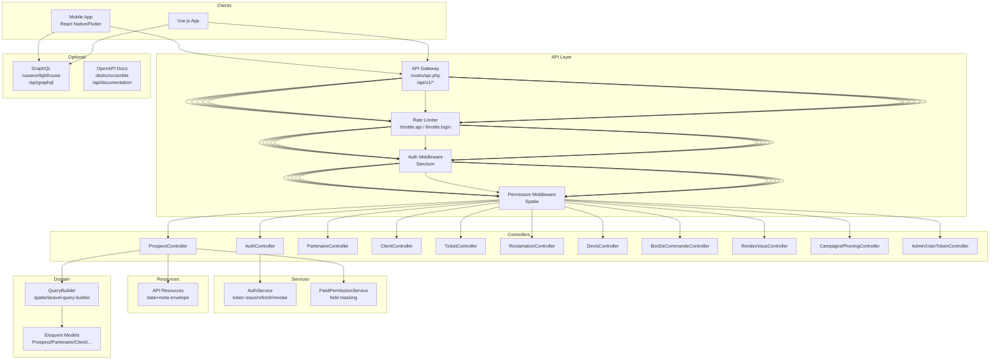
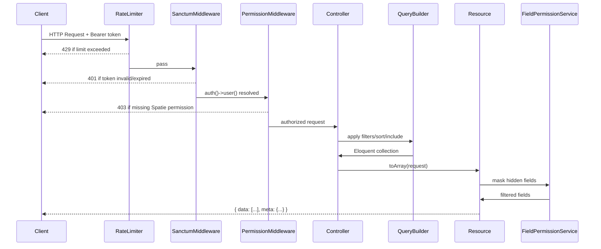
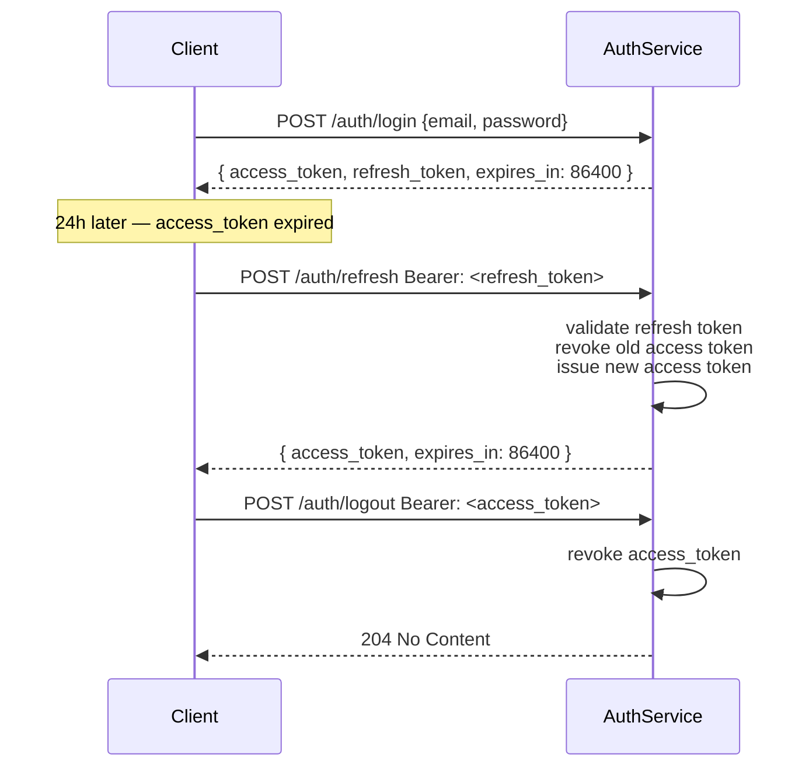

# Design Document — api-platform-integration

## Overview

This document describes the technical design for adding a dedicated REST API layer (with optional GraphQL) to the existing Laravel 12 + Filament 3 CRM application. The API exposes CRM data to external clients — a mobile application (React Native/Flutter) and a Vue.js frontend — without disrupting the Filament admin panel.

### Key Design Decisions

| Decision | Choice | Rationale |
|---|---|---|
| Authentication | Laravel Sanctum (new install) | Tight Laravel integration, stateless token support, coexists with existing `ApiToken` model |
| Authorization | Spatie `laravel-permission` (existing) | Consistent with Filament panel permissions — no duplication |
| Route versioning | `/api/v1/` prefix in `routes/api.php` | Clean separation; allows future `/api/v2/` without breaking changes |
| Serialization | Laravel API Resources with `data`/`meta` envelope | Laravel-native, supports field masking via `FieldPermission` |
| Filtering/Sorting | `spatie/laravel-query-builder` | Declarative allow-lists prevent SQL injection; integrates cleanly with Eloquent |
| API Documentation | `dedoc/scramble` | Zero-annotation OpenAPI 3.1 generation from route definitions + FormRequests |
| GraphQL (optional) | `nuwave/lighthouse` | Schema-first GraphQL with Eloquent model directives |
| Testing | PestPHP (existing) + `larastan/larastan` | Consistent with project, property-based testing via `pestphp/pest-plugin-arch` |

### Scope

The Filament admin panel (`routes/web.php`, `app/Filament/**`) is **not touched**. All new code lives under:
- `routes/api.php` (new file)
- `app/Http/Controllers/Api/V1/`
- `app/Http/Requests/Api/V1/`
- `app/Http/Resources/Api/V1/`
- `app/Http/Middleware/` (new API-specific middleware)
- `app/Policies/` (new resource policies)

---

## Architecture

### Component Diagram




### Request Lifecycle



---

## Components and Interfaces

### Directory Structure


```
app/
├── Http/
│   ├── Controllers/
│   │   └── Api/
│   │       └── V1/
│   │           ├── AuthController.php
│   │           ├── ProspectController.php
│   │           ├── PartenaireController.php
│   │           ├── ClientController.php
│   │           ├── TicketController.php
│   │           ├── ReclamationController.php
│   │           ├── DevisController.php
│   │           ├── BonDeCommandeController.php
│   │           ├── RendezVousController.php
│   │           ├── CampagnePhoningController.php
│   │           └── Admin/
│   │               └── UserTokenController.php
│   ├── Middleware/
│   │   ├── ForceJsonResponse.php
│   │   └── EnsureTokenIsNotExpired.php
│   ├── Requests/
│   │   └── Api/
│   │       └── V1/
│   │           ├── Auth/
│   │           │   ├── LoginRequest.php
│   │           │   └── RefreshRequest.php
│   │           ├── Prospect/
│   │           │   ├── StoreProspectRequest.php
│   │           │   └── UpdateProspectRequest.php
│   │           ├── Partenaire/
│   │           │   ├── StorePartenaireRequest.php
│   │           │   └── UpdatePartenaireRequest.php
│   │           ├── Ticket/
│   │           │   ├── StoreTicketRequest.php
│   │           │   └── UpdateTicketRequest.php
│   │           ├── Reclamation/
│   │           │   ├── StoreReclamationRequest.php
│   │           │   └── UpdateReclamationRequest.php
│   │           ├── RendezVous/
│   │           │   ├── StoreRendezVousRequest.php
│   │           │   └── UpdateRendezVousRequest.php
│   │           └── Prospect/
│   │               └── EnregistrerAppelRequest.php
│   └── Resources/
│       └── Api/
│           └── V1/
│               ├── ProspectResource.php
│               ├── ProspectCollection.php
│               ├── PartenaireResource.php
│               ├── PartenaireCollection.php
│               ├── ClientResource.php
│               ├── ClientCollection.php
│               ├── TicketResource.php
│               ├── ReclamationResource.php
│               ├── DevisResource.php
│               ├── BonDeCommandeResource.php
│               ├── RendezVousResource.php
│               └── CampagnePhoningResource.php
├── Policies/
│   ├── ProspectPolicy.php
│   ├── PartenairePolicy.php
│   ├── ClientPolicy.php
│   ├── TicketPolicy.php
│   ├── ReclamationPolicy.php
│   ├── DevisPolicy.php
│   ├── BonDeCommandePolicy.php
│   ├── RendezVousPolicy.php
│   └── CampagnePhoningPolicy.php
└── Services/
    └── Api/
        ├── AuthService.php
        └── FieldPermissionService.php
routes/
└── api.php                    ← new file
config/
└── api.php                    ← rate limits, GraphQL flag, token TTLs
graphql/                       ← optional, lighthouse schema
└── schema.graphql
```

### AuthController

```php
namespace App\Http\Controllers\Api\V1;

class AuthController extends Controller
{
    // POST /api/v1/auth/login
    public function login(LoginRequest $request): JsonResponse

    // POST /api/v1/auth/refresh
    public function refresh(RefreshRequest $request): JsonResponse

    // POST /api/v1/auth/logout
    public function logout(Request $request): JsonResponse

    // GET /api/v1/auth/me
    public function me(Request $request): JsonResponse
}
```

### Resource Controllers (uniform pattern)

All resource controllers extend a base `ApiController` that provides the `paginate()` helper and a consistent `success()` / `error()` response factory.

```php
namespace App\Http\Controllers\Api\V1;

abstract class ApiController extends Controller
{
    protected function success(mixed $data, int $status = 200): JsonResponse
    protected function error(string $message, int $status, array $errors = []): JsonResponse
    protected function paginate(QueryBuilder $query, string $resourceClass): JsonResponse
}
```

### routes/api.php skeleton

```php
Route::prefix('v1')->name('api.v1.')->group(function () {
    // Auth (unauthenticated, rate-limited separately)
    Route::post('auth/login',   [AuthController::class, 'login'])->middleware('throttle:login');
    Route::post('auth/refresh', [AuthController::class, 'refresh'])->middleware('throttle:login');

    // Protected routes
    Route::middleware(['auth:sanctum', 'throttle:api'])->group(function () {
        Route::post('auth/logout', [AuthController::class, 'logout']);
        Route::get('auth/me',     [AuthController::class, 'me']);

        Route::apiResource('prospects',           ProspectController::class);
        Route::post('prospects/{prospect}/appel', [ProspectController::class, 'enregistrerAppel']);

        Route::apiResource('partenaires',         PartenaireController::class)->except(['destroy']);
        Route::get('partenaires/{partenaire}/contacts',    [PartenaireController::class, 'contacts']);
        Route::get('partenaires/{partenaire}/rendez-vous', [PartenaireController::class, 'rendezVous']);

        Route::get('clients',                     [ClientController::class, 'index']);
        Route::get('clients/{client}',            [ClientController::class, 'show']);
        Route::get('clients/{client}/dossiers-formation', [ClientController::class, 'dossiersFormation']);

        Route::apiResource('tickets',      TicketController::class);
        Route::apiResource('reclamations', ReclamationController::class)->except(['destroy']);

        Route::get('devis',         [DevisController::class, 'index']);
        Route::get('devis/{devis}', [DevisController::class, 'show']);

        Route::get('bons-de-commande',              [BonDeCommandeController::class, 'index']);
        Route::get('bons-de-commande/{bdc}',        [BonDeCommandeController::class, 'show']);

        Route::apiResource('rendez-vous', RendezVousController::class)->except(['destroy']);

        Route::get('campagnes-phoning',                              [CampagnePhoningController::class, 'index']);
        Route::get('campagnes-phoning/{campagne}',                   [CampagnePhoningController::class, 'show']);
        Route::get('campagnes-phoning/{campagne}/prospects',         [CampagnePhoningController::class, 'prospects']);

        // Admin
        Route::middleware('role:super_admin|administrateur')->group(function () {
            Route::delete('admin/users/{user}/tokens', [UserTokenController::class, 'revokeAll']);
        });
    });
});
```

---

## Data Models

### Authentication: Sanctum + existing ApiToken coexistence


Sanctum creates a `personal_access_tokens` table (morphic to `users`). The existing `ApiToken` model (`api_tokens` table) is **kept as-is** but deprecated for external client use — it will continue serving any internal admin scripts that depend on it. New external clients exclusively use Sanctum tokens.

The `User` model gains the `HasApiTokens` trait from Sanctum:

```php
use Laravel\Sanctum\HasApiTokens;

class User extends Authenticatable implements FilamentUser
{
    use HasApiTokens, HasFactory, HasRoles, Notifiable, SoftDeletes, ...;
```

Filament's session-based authentication is unaffected because Sanctum guards are only active on the `api` guard, not the `web` guard used by Filament.

**Token pair strategy**:

Sanctum natively issues opaque tokens. To implement a refresh token pattern without JWT:
- Login issues **two** Sanctum tokens: `access` (expires 24h) and `refresh` (expires 30d).
- Both tokens are stored in `personal_access_tokens` with appropriate names and `expires_at`.
- The `refresh` token has the ability `[refresh]` in its abilities array; the `access` token has `[*]` minus `[refresh]`.
- Calling `POST /auth/refresh` with a Bearer refresh token deletes the old access token and issues a new one.



### Authorization: Spatie + Policy Layer

Laravel Policies bridge between Sanctum-authenticated users and Spatie permissions. Each resource has a Policy that delegates to Spatie's `$user->can()`.

```php
// app/Policies/ProspectPolicy.php
class ProspectPolicy
{
    public function viewAny(User $user): bool
    {
        return $user->hasPermissionTo('view_prospect');
    }

    public function view(User $user, Prospect $prospect): bool
    {
        if ($user->isTeleprospecteur()) {
            return $prospect->teleprospecteur_id === $user->id;
        }
        return $user->hasPermissionTo('view_prospect');
    }

    public function create(User $user): bool
    {
        return $user->hasPermissionTo('create_prospect');
    }

    public function update(User $user, Prospect $prospect): bool
    {
        return $user->hasPermissionTo('edit_prospect');
    }

    public function delete(User $user, Prospect $prospect): bool
    {
        return $user->hasPermissionTo('delete_prospect');
    }

    public function validerQf(User $user): bool
    {
        return $user->crmProfile?->can_validate_qf === true;
    }
}
```

Controllers call `$this->authorize()` which triggers policy methods automatically.

### FieldPermission Integration in API Resources

```php
// app/Http/Resources/Api/V1/ProspectResource.php
class ProspectResource extends JsonResource
{
    public function toArray(Request $request): array
    {
        $role = $request->user()->role_cache ?? 'guest';
        $fp   = app(FieldPermissionService::class);

        $all = [
            'id'             => $this->id,
            'nom'            => $this->nom,
            'statut'         => $this->statut->value,
            'statut_label'   => $this->statut->label(),
            'siret'          => $this->siret,
            'telephone'      => $this->telephone,
            'email'          => $this->email,
            'ville'          => $this->ville,
            'departement'    => $this->departement,
            'commercial'     => new UserMinimalResource($this->whenLoaded('commercial')),
            'teleprospecteur'=> new UserMinimalResource($this->whenLoaded('teleprospecteur')),
            'qf_valide'      => $this->qf_valide,
            'created_at'     => $this->created_at?->toIso8601String(),
            'updated_at'     => $this->updated_at?->toIso8601String(),
        ];

        return $fp->filterFields($all, $role, 'prospects', 'view');
    }
}
```

`FieldPermissionService::filterFields()` queries `FieldPermission` records and removes keys where `visible_view = false` for the given role and resource.

### Pagination & Filtering with spatie/laravel-query-builder

```php
// ProspectController::index()
public function index(Request $request): JsonResponse
{
    $prospects = QueryBuilder::for(Prospect::class)
        ->allowedFilters([
            AllowedFilter::exact('statut'),
            AllowedFilter::exact('campagne_id'),
            AllowedFilter::scope('search'),   // maps to scopeSearch()
        ])
        ->allowedSorts(['created_at', 'nom', 'statut', 'updated_at'])
        ->allowedIncludes(['teleprospecteur', 'commercial', 'campagne'])
        ->defaultSort('-created_at');

    // Scope restriction for teleprospecteurs
    if ($request->user()->isTeleprospecteur()) {
        $prospects->where('teleprospecteur_id', $request->user()->id);
    }

    return $this->paginate($prospects, ProspectResource::class);
}
```

The `paginate()` helper in `ApiController`:

```php
protected function paginate(QueryBuilder|Builder $query, string $resourceClass): JsonResponse
{
    $perPage = min((int) request('per_page', 25), 100);
    $paginator = $query->paginate($perPage);

    return response()->json([
        'data' => $resourceClass::collection($paginator->items()),
        'meta' => [
            'total'         => $paginator->total(),
            'per_page'      => $paginator->perPage(),
            'current_page'  => $paginator->currentPage(),
            'last_page'     => $paginator->lastPage(),
            'next_page_url' => $paginator->nextPageUrl(),
            'prev_page_url' => $paginator->previousPageUrl(),
        ],
    ]);
}
```

### Rate Limiting (config/api.php + RouteServiceProvider)

```php
// app/Providers/RouteServiceProvider.php (or bootstrap/app.php in Laravel 12)
RateLimiter::for('api', function (Request $request) {
    return Limit::perHour(1000)->by($request->user()?->id ?: $request->ip())
        ->response(fn () => response()->json([
            'message' => 'Too Many Requests',
        ], 429));
});

RateLimiter::for('login', function (Request $request) {
    return Limit::perMinute(10)->by($request->ip())
        ->response(fn () => response()->json([
            'message' => 'Too Many Attempts',
        ], 429));
});
```

The `throttle:api` middleware automatically injects `X-RateLimit-Limit` and `X-RateLimit-Remaining` headers.

### OpenAPI Documentation (dedoc/scramble)

`dedoc/scramble` reads route definitions and FormRequest `rules()` to generate an OpenAPI 3.1 spec automatically. No additional annotations are required.

```php
// config/scramble.php
return [
    'api_path' => 'api/v1',
    'api_domain' => null,
    'info' => [
        'title' => 'CRM API',
        'version' => '1.0.0',
    ],
    'middleware' => [
        'web',
        fn () => app()->environment('production')
            ? abort(403, 'API documentation is not available in production.')
            : null,
    ],
];
```

Scramble UI is served at `/api/documentation`. The spec is regenerable via `php artisan scramble:export`.

### GraphQL Layer (optional, nuwave/lighthouse)

When `config('api.graphql_enabled')` is `true`, Lighthouse registers `/api/graphql` and `/api/graphql-playground` (non-production only). The schema mirrors the REST resources:

```graphql
# graphql/schema.graphql
type Query {
    prospects(
        statut: String
        search: String
        first: Int = 25
        page: Int
    ): ProspectPaginator! @paginate @guard(with: ["sanctum"])

    prospect(id: ID!): Prospect @find @guard(with: ["sanctum"])

    partenaires(first: Int = 25, page: Int): PartenairePaginator! @paginate @guard(with: ["sanctum"])
    partenaire(id: ID!): Partenaire @find @guard(with: ["sanctum"])
}

type Prospect {
    id: ID!
    nom: String!
    statut: String!
    siret: String
    telephone: String
    email: String
    ville: String
    commercial: User @belongsTo
    created_at: DateTime!
}
```

Spatie permission checks are applied via a custom Lighthouse middleware that mirrors the REST permission guard.

---

## Error Handling

All API error responses conform to the envelope `{ "message": "...", "errors": { ... } }`.

Laravel's exception handler is extended in `bootstrap/app.php`:

```php
->withExceptions(function (Exceptions $exceptions) {
    $exceptions->render(function (Throwable $e, Request $request) {
        if ($request->is('api/*')) {
            return match(true) {
                $e instanceof AuthenticationException =>
                    response()->json(['message' => 'Unauthenticated.'], 401),

                $e instanceof AuthorizationException =>
                    response()->json(['message' => 'This action is unauthorized.'], 403),

                $e instanceof ModelNotFoundException =>
                    response()->json(['message' => 'Resource not found.'], 404),

                $e instanceof ValidationException =>
                    response()->json([
                        'message' => 'The given data was invalid.',
                        'errors'  => $e->errors(),
                    ], 422),

                $e instanceof ThrottleRequestsException =>
                    response()->json(['message' => 'Too many requests.'], 429)
                        ->header('Retry-After', $e->getHeaders()['Retry-After'] ?? 60),

                default =>
                    response()->json([
                        'message'    => 'Server error.',
                        'error_id'   => $errorId = Str::uuid(),
                    ], 500),
            };
        }
    });
})
```

Stack traces are **never** returned. Unhandled exceptions are logged with a unique `error_id` for traceability.

### HTTP Status Code Reference

| Scenario | Code |
|---|---|
| Success (read) | 200 |
| Created | 201 |
| Updated | 200 |
| No content (logout) | 204 |
| Validation error | 422 |
| Unauthenticated | 401 |
| Forbidden (missing permission) | 403 |
| Not found | 404 |
| Rate limit exceeded | 429 |
| Server error | 500 |

---

## Correctness Properties

*A property is a characteristic or behavior that should hold true across all valid executions of a system — essentially, a formal statement about what the system should do. Properties serve as the bridge between human-readable specifications and machine-verifiable correctness guarantees.*

### Property 1: JSON Content-Type for all API responses

*For any* valid HTTP request to `/api/v1/*`, the response Content-Type header SHALL contain `application/json`, regardless of the endpoint, HTTP method, or authentication state.

**Validates: Requirements 1.2**

### Property 2: Valid token always authenticates

*For any* Sanctum access token that has not expired and has not been revoked, a request to any protected endpoint with `Authorization: Bearer <token>` SHALL receive a response with HTTP status 2xx (not 401).

**Validates: Requirements 2.3**

### Property 3: Refresh cycle produces a functional token

*For any* authenticated user, the sequence (login → obtain refresh_token → call refresh endpoint) SHALL produce a new access_token that successfully authenticates a subsequent request.

**Validates: Requirements 2.5**

### Property 4: Logout revokes the token

*For any* authenticated user, the sequence (login → obtain access_token → logout → attempt request with same token) SHALL result in a 401 response on the final step.

**Validates: Requirements 2.6**

### Property 5: Permission gate enforces role access

*For any* user–role–resource combination where the role does not have the required Spatie permission (`view_X`, `create_X`, or `edit_X`), the corresponding API request SHALL return HTTP 403.

**Validates: Requirements 3.1, 3.2, 3.3**

### Property 6: FieldPermission masks hidden fields

*For any* serialized resource response, fields whose `FieldPermission` record has `visible_view = false` for the authenticated user's role SHALL be absent from the JSON response body.

**Validates: Requirements 3.4, 12.4**

### Property 7: Téléprospecteur scope isolation

*For any* user with role `teleprospecteur`, `GET /api/v1/prospects` SHALL return only prospects where `teleprospecteur_id` equals the authenticated user's ID — never prospects belonging to other teleprospecteurs.

**Validates: Requirements 3.5**

### Property 8: QF validation respects CrmProfile gate

*For any* user with `CrmProfile.can_validate_qf = false`, a request to validate a prospect's QF status SHALL return HTTP 403. *For any* user with `can_validate_qf = true`, the same request SHALL succeed.

**Validates: Requirements 3.6**

### Property 9: Filter by statut returns only matching records

*For any* valid `ProspectStatut` value supplied as `filter[statut]`, every prospect in the response data array SHALL have `statut` equal to the requested value.

**Validates: Requirements 4.2**

### Property 10: Invalid POST payload returns 422 with field errors

*For any* POST/PUT request to a resource endpoint with a payload missing required fields or containing invalid formats, the response SHALL be HTTP 422 with a JSON body containing an `errors` object keyed by the invalid field names.

**Validates: Requirements 4.6, 9.5**

### Property 11: Date range filter returns only in-range RendezVous

*For any* `[filter[date_debut], filter[date_fin]]` interval, every RendezVous in the response data array SHALL have its date within the interval (inclusive on both bounds).

**Validates: Requirements 9.3**

### Property 12: Pagination metadata always present

*For any* collection endpoint response (2xx), the JSON body SHALL contain a `meta` object with the keys `total`, `per_page`, `current_page`, `last_page`, `next_page_url`, and `prev_page_url`.

**Validates: Requirements 11.1, 11.4**

### Property 13: per_page capped at 100

*For any* `per_page` query parameter value greater than 100, the actual number of items in `data` SHALL be at most 100, and `meta.per_page` SHALL equal 100.

**Validates: Requirements 11.3**

### Property 14: Success response envelope

*For any* 2xx API response from a resource endpoint, the JSON body SHALL contain a `data` key at the root level.

**Validates: Requirements 12.1**

### Property 15: Error response envelope

*For any* 4xx or 5xx API response, the JSON body SHALL contain a `message` key at the root level.

**Validates: Requirements 12.2**

### Property 16: Enum fields serialized as strings

*For any* API resource response containing an Enum-backed field (e.g., `statut` on Prospect, `type` on Partenaire), the serialized value SHALL be a non-empty string (the Enum's `value`), not an integer or null.

**Validates: Requirements 12.3**

### Property 17: Serialization round-trip

*For any* Eloquent model instance serialized through its API Resource, the key fields (id, all non-hidden fillable scalars, enum values as strings) SHALL be recoverable from the JSON response without data loss or type corruption.

**Validates: Requirements 12.6**

### Property 18: Rate limit headers present on authenticated responses

*For any* authenticated API response, the HTTP headers `X-RateLimit-Limit` and `X-RateLimit-Remaining` SHALL be present.

**Validates: Requirements 14.4**

### Property 19: Token events are logged

*For any* login, refresh, or logout action, a log entry SHALL be created containing the user's ID, the originating IP address, and a timestamp.

**Validates: Requirements 15.4**

---

## Testing Strategy

### Overview

PestPHP is already installed. The strategy uses two complementary layers:

- **Unit/Feature tests** — specific examples, edge cases, integration points
- **Property-based tests** — universal properties across generated inputs (using `edalzell/pest-plugin-arch` for architecture, and hand-rolled generators for business properties)

For property-based testing in PHP/PestPHP, `pestphp/pest-plugin-arch` handles structural properties. For data-driven property tests, we use `pest()->with()` combined with factories and dataset generators.

### Property Test Configuration

Each property test uses `test()->with(fn() => [...])` with 100+ generated inputs via Laravel factories and PHP generators. Tag format in comments: `Feature: api-platform-integration, Property N: <property_text>`.

Minimum 100 iterations per property test.

### Test File Structure

```
tests/
├── Feature/
│   └── Api/
│       └── V1/
│           ├── Auth/
│           │   ├── LoginTest.php
│           │   ├── LogoutTest.php
│           │   └── RefreshTest.php
│           ├── Prospects/
│           │   ├── ProspectCrudTest.php
│           │   ├── ProspectFilterTest.php
│           │   └── ProspectPermissionTest.php
│           ├── Partenaires/
│           │   └── PartenaireTest.php
│           ├── Clients/
│           │   └── ClientTest.php
│           ├── Tickets/
│           │   └── TicketTest.php
│           ├── RendezVous/
│           │   └── RendezVousTest.php
│           └── Pagination/
│               └── PaginationTest.php
└── Unit/
    └── Api/
        ├── Resources/
        │   ├── ProspectResourceTest.php
        │   └── FieldPermissionServiceTest.php
        └── Services/
            └── AuthServiceTest.php
```

### Key Property Test Examples

```php
// tests/Feature/Api/V1/Prospects/ProspectFilterTest.php
// Feature: api-platform-integration, Property 9: Filter by statut returns only matching records
it('filter[statut] returns only prospects with the requested statut', function (string $statut) {
    $user = User::factory()->withRole('commercial')->create();
    Prospect::factory()->count(5)->create(['statut' => $statut]);
    Prospect::factory()->count(3)->create(['statut' => 'KO']); // noise

    $response = $this->actingAs($user, 'sanctum')
        ->getJson("/api/v1/prospects?filter[statut]={$statut}");

    $response->assertOk();
    collect($response->json('data'))->each(
        fn ($item) => expect($item['statut'])->toBe($statut)
    );
})->with(array_map(fn($s) => $s->value, ProspectStatut::cases()));


// tests/Feature/Api/V1/Pagination/PaginationTest.php
// Feature: api-platform-integration, Property 13: per_page capped at 100
it('caps per_page at 100 for any value above 100', function (int $perPage) {
    $user = User::factory()->withRole('commercial')->create();
    Prospect::factory()->count(5)->create();

    $response = $this->actingAs($user, 'sanctum')
        ->getJson("/api/v1/prospects?per_page={$perPage}");

    $response->assertOk();
    expect($response->json('meta.per_page'))->toBeLessThanOrEqual(100);
    expect(count($response->json('data')))->toBeLessThanOrEqual(100);
})->with(fn () => array_map(fn() => rand(101, 10000), range(0, 99)));


// tests/Unit/Api/Resources/FieldPermissionServiceTest.php
// Feature: api-platform-integration, Property 6: FieldPermission masks hidden fields
it('removes fields marked not visible for the role', function (string $role, string $field) {
    FieldPermission::factory()->create([
        'role' => $role, 'resource' => 'prospects',
        'field_name' => $field, 'visible_view' => false,
    ]);
    $prospect = Prospect::factory()->create();
    $service  = new FieldPermissionService;
    $data     = array_fill_keys([$field, 'nom', 'id'], 'value');

    $result = $service->filterFields($data, $role, 'prospects', 'view');

    expect($result)->not->toHaveKey($field);
    expect($result)->toHaveKey('nom');
})->with(fn () => array_map(
    fn() => [fake()->randomElement(array_keys(User::ROLES)), fake()->word()],
    range(0, 99)
));
```

### Integration Tests (example-based)

- `LoginTest`: valid credentials → 200 with access_token + refresh_token
- `LoginTest`: invalid credentials → 401 with generic message (no field hint)
- `LoginTest`: rate limit — 11 rapid login attempts → 429 with Retry-After header
- `AuthTest`: expired token → 401 with `token_expired` error code
- `AdminTest`: admin revokes all tokens for user → subsequent requests 401
- `OpenApiTest`: `/api/documentation` returns 200 in non-production, 403 in production mock

### Unit Tests

- `FieldPermissionService`: returns all fields when no FieldPermission records exist (default visible)
- `AuthService`: token creation sets correct `expires_at` (access = now + 24h, refresh = now + 30d)
- `ProspectResource`: enum `statut` serializes to string value, not integer
- `ApiController::paginate()`: enforces 100-item cap, returns all required meta keys
