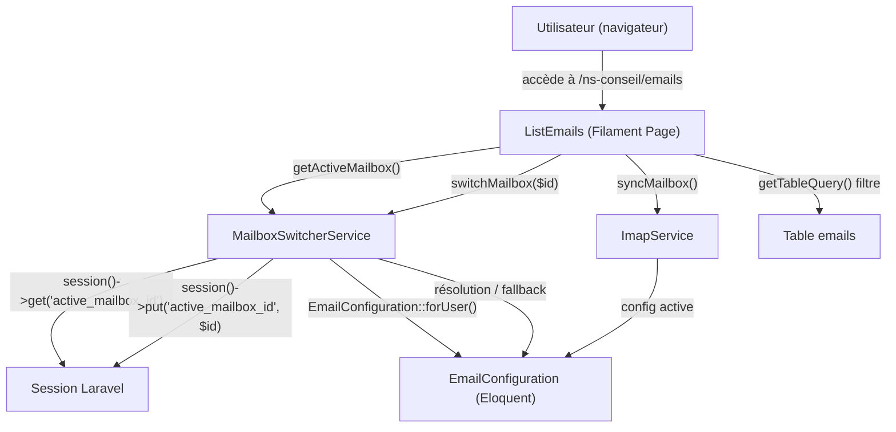

# Design Document — Email Mailbox Switcher

## Overview

La fonctionnalité **Mailbox Switcher** enrichit la page `ListEmails` du panel NsConseil avec un sélecteur de boîte mail active. Elle permet à l'utilisateur de choisir quelle `EmailConfiguration` est utilisée pour filtrer les emails affichés et cibler la synchronisation IMAP.

### Contexte technique

Le code actuel dans `ListEmails::getTableQuery()` filtre les emails par `user_id = auth()->id()`, et `syncMailbox()` récupère la première config active via `EmailConfiguration::forUser()`. Ces deux points sont les pivots de la modification.

La persistance du choix se fait en **session HTTP Laravel** (clé `active_mailbox_id`). Aucune modification de schéma de base de données n'est nécessaire.

---

## Architecture



### Flux principal

1. L'utilisateur arrive sur `/ns-conseil/emails`.
2. `ListEmails` appelle `MailboxSwitcherService::resolveActiveMailbox()` pour déterminer la boîte active (depuis la session ou par défaut).
3. Le sélecteur (header action) affiche la liste des configurations disponibles et surligne l'active.
4. Quand l'utilisateur bascule, `switchMailbox($id)` met à jour la session et Livewire recharge la table.
5. `getTableQuery()` applique le filtre correspondant à la boîte active.
6. `syncMailbox()` utilise la boîte active pour instancier `ImapService`.

---

## Components and Interfaces

### 1. `MailboxSwitcherService`

Nouveau service PHP (`app/Services/Email/MailboxSwitcherService.php`).

```php
interface MailboxSwitcherServiceInterface
{
    /**
     * Retourne la liste des EmailConfiguration disponibles pour l'utilisateur,
     * triée : personnelles en premier, globales ensuite.
     *
     * @param  int  $userId
     * @return \Illuminate\Support\Collection<EmailConfiguration>
     */
    public function getAvailableMailboxes(int $userId): Collection;

    /**
     * Résout l'Active_Mailbox pour l'utilisateur :
     * 1. Session active_mailbox_id si valide et accessible
     * 2. Fallback sur la première config disponible
     * 3. null si aucune config disponible
     *
     * @param  int  $userId
     * @return EmailConfiguration|null
     */
    public function resolveActiveMailbox(int $userId): ?EmailConfiguration;

    /**
     * Enregistre le choix en session.
     *
     * @param  int  $configId
     * @return void
     */
    public function switchMailbox(int $configId): void;
}
```

**Méthodes clés :**

| Méthode | Responsabilité |
|---|---|
| `getAvailableMailboxes($userId)` | Retourne toutes les `EmailConfiguration` actives et accessibles pour l'utilisateur, triées (personnelles puis globales) |
| `resolveActiveMailbox($userId)` | Résolution avec priorité session → fallback premier disponible → null |
| `switchMailbox($configId)` | `session(['active_mailbox_id' => $configId])` |

### 2. Modifications de `ListEmails`

Le fichier `app/Filament/NsConseil/Resources/EmailResource/Pages/ListEmails.php` est modifié pour :

- Injecter `MailboxSwitcherService` via le constructeur ou `app()`.
- Ajouter une **header action** `mailbox_switcher` (composant Select Filament) dans `getHeaderActions()`.
- Surcharger `getTableQuery()` pour filtrer par boîte active.
- Modifier `syncMailbox()` pour utiliser la boîte active.
- Émettre un event Livewire `$refresh` après le `switchMailbox()`.

#### Header Action — Mailbox Switcher

```php
Actions\Action::make('mailbox_switcher')
    ->label(fn () => $this->getActiveMailboxLabel())
    ->icon('heroicon-o-inbox')
    ->form([
        Forms\Components\Select::make('mailbox_id')
            ->label('Boîte mail active')
            ->options(fn () => $this->getMailboxOptions())
            ->default(fn () => session('active_mailbox_id'))
            ->disabled(fn () => $this->getAvailableMailboxCount() <= 1)
            ->allowHtml()
            ->required(),
    ])
    ->action(function (array $data) {
        app(MailboxSwitcherService::class)->switchMailbox((int) $data['mailbox_id']);
        $this->resetPage();
    }),
```

> **Alternative légère :** exposer un `public int $activeMailboxId` (propriété Livewire) directement mis à jour par un `<x-filament::input.select>` dans un `headerWidget` ou via une `SelectAction` sans formulaire modale. Le choix final dépend du style du panel, mais une action de formulaire Filament standard est la voie recommandée pour rester cohérent avec le reste du panel.

### 3. Modifications de `EmailResource::table()`

La colonne `mailbox` existante dans la table sera mise à jour pour afficher la boîte active résolue plutôt que d'interroger `EmailConfiguration` à chaque ligne.

### 4. `EmailConfiguration` — aucune modification

Le modèle est déjà complet : `scopeForUser`, `scopeActive`, `is_global`, `email`, `from_name`. Aucun changement de schéma requis.

---

## Data Models

### Session

```
Session key : active_mailbox_id
Type        : integer (EmailConfiguration.id)
Durée       : durée de la session HTTP Laravel (configurable)
```

### Logique de filtrage des emails selon le type de boîte

| Type de configuration | Condition SQL sur `emails` |
|---|---|
| Personnelle (`is_global = false`) | `user_id = auth()->id()` ET `from_email = config->email` (ou uniquement `user_id` selon besoin) |
| Globale (`is_global = true`) | `from_email = config->email` |

La logique de résolution est encapsulée dans `MailboxSwitcherService::buildEmailQuery(EmailConfiguration $config)` ou directement dans `ListEmails::getTableQuery()`.

### Structure des options du sélecteur

```php
// Exemple de construction des options
$options = $availableMailboxes->mapWithKeys(function (EmailConfiguration $config) {
    $label = $config->from_name
        ? "{$config->from_name} <{$config->email}>"
        : $config->email;

    if ($config->is_global) {
        $label .= ' 🌐'; // ou badge HTML via allowHtml()
    }

    return [$config->id => $label];
});
```

---

## Correctness Properties

*A property is a characteristic or behavior that should hold true across all valid executions of a system — essentially, a formal statement about what the system should do. Properties serve as the bridge between human-readable specifications and machine-verifiable correctness guarantees.*

### Property 1: Le sélecteur affiche les informations complètes de chaque configuration

*For any* `EmailConfiguration` fournie comme `Active_Mailbox`, le label généré pour le sélecteur doit contenir l'adresse email de la configuration. Si `from_name` est renseigné, il doit également apparaître dans le label.

**Validates: Requirements 1.1, 6.3**

---

### Property 2: Unicité = sélecteur désactivé

*For any* utilisateur disposant d'exactement une `EmailConfiguration` active accessible, `getAvailableMailboxes()` retourne exactement un élément et le sélecteur doit être dans l'état `disabled`.

**Validates: Requirements 1.2, 6.2**

---

### Property 3: Toutes les configurations accessibles sont listées

*For any* utilisateur avec N configurations actives et accessibles (N > 1), `getAvailableMailboxes()` retourne exactement N éléments — ni plus, ni moins.

**Validates: Requirements 2.1**

---

### Property 4: Basculement mémorisé en session (round-trip)

*For any* identifiant d'`EmailConfiguration` valide, appeler `switchMailbox($id)` doit résulter en `session()->get('active_mailbox_id') === $id`.

**Validates: Requirements 2.2, 3.1**

---

### Property 5: Ordre de tri — personnelles avant globales

*For any* ensemble de configurations disponibles contenant un mélange de configs personnelles (`is_global = false`) et globales (`is_global = true`), le résultat de `getAvailableMailboxes()` doit placer tous les éléments `is_global = false` avant tous les éléments `is_global = true`.

**Validates: Requirements 2.5**

---

### Property 6: Filtrage des emails cohérent avec la boîte active

*For any* `EmailConfiguration` sélectionnée comme boîte active :
- Si la configuration est globale (`is_global = true`), la requête doit filtrer les emails sur `from_email = config->email`.
- Si la configuration est personnelle (`is_global = false`), la requête doit filtrer les emails sur `user_id = auth()->id()`.

Aucun email d'une autre boîte ne doit apparaître dans le résultat.

**Validates: Requirements 4.1, 4.2, 4.3**

---

### Property 7: Résolution de la boîte active avec session valide

*For any* `active_mailbox_id` stocké en session pointant vers une `EmailConfiguration` qui est encore active et accessible pour l'utilisateur courant, `resolveActiveMailbox()` doit retourner exactement cette configuration.

**Validates: Requirements 3.2**

---

### Property 8: Fallback vers la première config disponible

*For any* `active_mailbox_id` stocké en session qui ne correspond pas à une configuration active et accessible pour l'utilisateur (inexistant, inactif, ou appartenant à un autre utilisateur sans `is_global = true`), `resolveActiveMailbox()` doit retourner la première `EmailConfiguration` disponible selon l'ordre de tri défini (personnelle > globale), ou `null` si aucune n'est disponible.

**Validates: Requirements 3.3, 3.4**

---

### Property 9: La synchronisation cible uniquement la boîte active

*For any* `EmailConfiguration` définie comme boîte active, l'appel à `syncMailbox()` doit instancier `ImapService` avec exactement cette configuration — et aucune autre.

**Validates: Requirements 5.1**

---

### Property 10: La notification de succès contient le nombre d'emails synchronisés

*For any* valeur de `stats['synced']` retournée par `ImapService::syncEmails()`, la notification de succès affichée doit inclure ce nombre dans son message.

**Validates: Requirements 5.3**

---

## Error Handling

### Aucune configuration disponible

- `resolveActiveMailbox()` retourne `null`.
- `ListEmails` affiche le sélecteur avec le message « Aucune boîte mail configurée » et désactive le bouton "Synchroniser".
- `syncMailbox()` affiche une notification `warning` sans invoquer `ImapService`.

### Configuration invalide en session

- `resolveActiveMailbox()` détecte que l'ID en session n'est plus accessible.
- Fallback automatique vers la première config disponible.
- La session est mise à jour avec le nouvel ID résolu.

### Erreur IMAP lors de la synchronisation

- `ImapService` lève une exception.
- `ListEmails::syncMailbox()` l'attrape dans le bloc `catch (\Throwable $e)`.
- `Log::error()` journalise l'exception avec le message.
- Une notification `danger` est affichée à l'utilisateur avec `$e->getMessage()`.

### Configuration supprimée ou désactivée entre deux requêtes

- La résolution au chargement de la page détecte l'incohérence.
- Fallback automatique et mise à jour de la session.
- Aucune erreur visible pour l'utilisateur.

---

## Testing Strategy

### Approche duale

Ce feature combine de la logique métier pure (service) et de l'UI Filament (ListEmails). L'approche est :

- **Tests unitaires** : couvrent `MailboxSwitcherService` (résolution, tri, session).
- **Tests property-based** : couvrent les propriétés universelles du service et du filtrage.
- **Tests d'exemple** : couvrent les cas spécifiques (aucune config, exception IMAP, pagination reset).
- **Tests d'intégration Filament** : couvrent le rendu de la page avec Livewire (optionnel, hors scope initial).

### Librairie PBT

**[Pest PHP](https://pestphp.com/)** avec le plugin **[pest-plugin-arch](https://github.com/pestphp/pest-plugin-arch)** est déjà dans l'écosystème Laravel. Pour la property-based testing, on utilisera **[RoachPHP/php-quick-check](https://github.com/leightonthomas/php-property-based-testing)** ou plus simplement **[Eris](https://github.com/giorgiosironi/eris)** si disponible. Dans le contexte Laravel/Pest, on peut également utiliser **[spatie/pest-plugin-test-time](https://github.com/spatie/pest-plugin-test-time)** pour la partie session.

> Recommandation : utiliser **[giorgiosironi/eris](https://github.com/giorgiosironi/eris)** (property-based testing pour PHP, compatible PHPUnit/Pest) avec un minimum de 100 itérations par propriété.

### Couverture par propriété

Chaque propriété de la section "Correctness Properties" est implémentée par un seul test property-based. Format de tag :

```
// Feature: email-mailbox-switcher, Property N: <property_text>
```

| Propriété | Type de test | Objet testé |
|---|---|---|
| Property 1 : label complet | Property | `MailboxSwitcherService::buildOptionLabel()` |
| Property 2 : unicité → disabled | Property | `MailboxSwitcherService::getAvailableMailboxes()` |
| Property 3 : liste complète | Property | `MailboxSwitcherService::getAvailableMailboxes()` |
| Property 4 : round-trip session | Property | `MailboxSwitcherService::switchMailbox()` |
| Property 5 : ordre de tri | Property | `MailboxSwitcherService::getAvailableMailboxes()` |
| Property 6 : filtrage emails | Property | `ListEmails::getTableQuery()` (via service) |
| Property 7 : résolution session valide | Property | `MailboxSwitcherService::resolveActiveMailbox()` |
| Property 8 : fallback | Property | `MailboxSwitcherService::resolveActiveMailbox()` |
| Property 9 : sync cible boîte active | Property | `ListEmails::syncMailbox()` avec mock ImapService |
| Property 10 : notification contient le count | Property | `ListEmails::syncMailbox()` avec mock ImapService |
| Aucune config → warning | Example | `ListEmails::syncMailbox()` |
| Exception IMAP → danger | Example | `ListEmails::syncMailbox()` |
| Aucune config → message UI | Example | `MailboxSwitcherService::resolveActiveMailbox()` |
| Pagination reset | Example | `ListEmails` après switch |

### Configuration des tests property-based

```php
// Exemple de structure dans tests/Unit/MailboxSwitcherServiceTest.php
it('sorts personal configs before global ones', function () {
    // Feature: email-mailbox-switcher, Property 5: personal configs appear before global configs
    $this->forAll(
        Generator\choose(1, 5), // nb configs perso
        Generator\choose(1, 5), // nb configs globales
    )->then(function (int $personal, int $global) {
        $configs = [
            ...EmailConfiguration::factory()->count($personal)->personal()->active()->make(),
            ...EmailConfiguration::factory()->count($global)->global()->active()->make(),
        ];
        // shuffle pour simuler un ordre DB aléatoire
        shuffle($configs);

        $result = $this->service->sortMailboxes(collect($configs));

        $switchedToGlobal = false;
        foreach ($result as $config) {
            if ($config->is_global) {
                $switchedToGlobal = true;
            }
            if ($switchedToGlobal) {
                expect($config->is_global)->toBeTrue();
            }
        }
    });
})->repeat(100);
```
