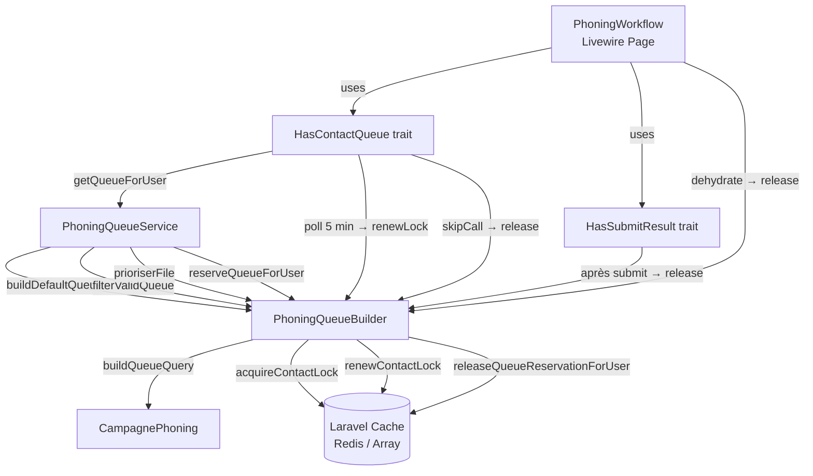

# Design Document — phoning-contact-lock

## Overview

Cette feature couvre deux comportements complémentaires pour le module de téléprospection :

1. **ContactLock** : mécanisme de verrouillage de fiche (prospect, partenaire, client) pendant qu'un téléprospecteur la travaille dans `PhoningWorkflow`. Le verrou est posé au chargement du contact, renouvelé par polling toutes les 5 minutes, et libéré à la soumission, au skip ou à la destruction de la page Livewire.

2. **Exclusion des rappels non échus** : les fiches dont le champ `rappel_planifie_at` est dans le futur sont exclues de la file d'appels jusqu'à l'heure prévue, aussi bien à la construction de la file (`CampagnePhoning::buildQueueQuery()`) qu'à sa validation en cache (`PhoningQueueBuilder::filterValidQueue()`).

Ces deux comportements sont étroitement liés : la construction et la validation de la file doivent appliquer à la fois l'exclusion des rappels non échus **et** l'exclusion des fiches verrouillées par autrui, dans un ordre déterministe.

### Objectifs

- Éviter les doublons d'appels sur le même contact par deux téléprospecteurs.
- Respecter la planification des rappels.
- Maintenir la compatibilité avec le comportement existant de `reserveQueueForUser()` et `prioriserFile()`.
- Rester observable (logs `debug`/`info`) pour le diagnostic superviseur.

---

## Architecture



### Flux nominal

1. `PhoningWorkflow::mount()` → `HasContactQueue::loadQueue()`
2. `PhoningQueueService::getQueueForUser()` : cache miss → `buildDefaultQueue()` (inclut exclusion rappels) → `prioriserFile()` → `reserveQueueForUser()` (inclut exclusion verrous étrangers)
3. `HasContactQueue::loadNextContact()` : libère le verrou précédent, pose un verrou sur le nouveau contact (`acquireContactLock`)
4. Polling Livewire toutes les 5 min → `HasContactQueue::renewCurrentContactLock()`
5. Soumission/skip/destroy → libération du verrou

### Flux de cache hit

Sur rechargement (cache hit), `filterValidQueue()` :
- Exclut les prospects avec `rappel_planifie_at > now()`
- Exclut les fiches verrouillées par un autre utilisateur (si `$userId` est fourni)
- Conserve l'ordre relatif des items non exclus

---

## Components and Interfaces

### `PhoningQueueBuilder` — nouvelles méthodes / modifications

#### `acquireContactLock(int $userId, string $type, int $id): bool`

Pose un verrou **atomique** via `Cache::add()` avec TTL 30 min.

```php
public function acquireContactLock(int $userId, string $type, int $id): bool
{
    $key = "phoning_queue_reservation_{$type}_{$id}";
    $acquired = Cache::add($key, $userId, now()->addMinutes(30));
    if ($acquired) {
        Log::debug('ContactLock posé', ['type' => $type, 'id' => $id, 'user' => $userId, 'action' => 'lock']);
    } else {
        $owner = Cache::get($key);
        if ((int) $owner !== $userId) {
            Log::info('ContactLock conflit', ['type' => $type, 'id' => $id, 'user' => $userId, 'owner' => $owner]);
        }
    }
    return $acquired || (int) Cache::get($key) === $userId;
}
```

Retourne `true` si le verrou a été acquis **ou** si l'utilisateur est déjà propriétaire (reentrant).

#### `renewContactLock(int $userId, string $type, int $id): bool`

Renouvelle le TTL uniquement si l'utilisateur est propriétaire du verrou.

```php
public function renewContactLock(int $userId, string $type, int $id): bool
{
    $key = "phoning_queue_reservation_{$type}_{$id}";
    if ((int) Cache::get($key) !== $userId) {
        return false;
    }
    Cache::put($key, $userId, now()->addMinutes(30));
    Log::debug('ContactLock renouvelé', ['type' => $type, 'id' => $id, 'user' => $userId, 'action' => 'renew']);
    return true;
}
```

#### `releaseQueueReservationForUser(int $userId, string $type, int $id): void`

Libère le verrou uniquement si l'utilisateur est propriétaire. Existant, à enrichir avec log :

```php
public function releaseQueueReservationForUser(int $userId, string $type, int $id): void
{
    $key = "phoning_queue_reservation_{$type}_{$id}";
    if ((int) Cache::get($key) === $userId) {
        Cache::forget($key);
        Log::debug('ContactLock libéré', ['type' => $type, 'id' => $id, 'user' => $userId, 'action' => 'release']);
    }
}
```

#### `reserveQueueForUser(int $userId, array $queue): array` — modification

TTL porté de 15 min → **30 min**. La logique reste inchangée (`Cache::add` + filtre).

#### `filterValidQueue(array $queue, ?int $userId = null): array` — modification

Ajout de deux filtres supplémentaires :

1. **Rappels non échus** (prospects) : exclure si `rappel_planifie_at` IS NOT NULL AND `> now()`.
2. **Verrous étrangers** (si `$userId` fourni) : exclure si la clé `phoning_queue_reservation_{type}_{id}` est définie et différente de `$userId`.

Signature : `filterValidQueue(array $queue, ?int $userId = null): array`

---

### `CampagnePhoning` — modification `buildQueueQuery()`

Ajout de la clause de filtrage rappel dans `buildQueueQuery()` pour les prospects uniquement :

```php
// Dans buildQueueQuery(), après les filtres existants, pour type 'prospects' :
$query->where(function ($q) {
    $q->whereNull('rappel_planifie_at')
      ->orWhere('rappel_planifie_at', '<=', now());
});
```

Cette clause est appliquée **à la construction** de la file (pas seulement au filtrage cache).

---

### `HasContactQueue` — modifications

#### `loadNextContact()` — libération + acquisition du verrou

```php
public function loadNextContact(): void
{
    // Libérer le verrou du contact précédent
    if ($this->currentContact !== null) {
        $type = $this->currentContact['type'] ?? null;
        $id   = (int) ($this->currentContact['id'] ?? 0);
        if ($type && $id > 0) {
            app(PhoningQueueBuilder::class)
                ->releaseQueueReservationForUser(Auth::id(), $type, $id);
        }
    }

    // Charger le contact suivant (logique existante)…
    // Puis acquérir le verrou sur le nouveau contact
    if ($this->currentContact !== null) {
        $type = $this->currentContact['type'] ?? null;
        $id   = (int) ($this->currentContact['id'] ?? 0);
        if ($type && $id > 0) {
            $acquired = app(PhoningQueueBuilder::class)
                ->acquireContactLock(Auth::id(), $type, $id);
            if (! $acquired) {
                $this->loadNextContact(); // contact verrouillé → passer au suivant
            }
        }
    }
}
```

#### `skipCall()` — libération du verrou avant le skip

```php
public function skipCall(): void
{
    if (empty($this->contactQueue) && $this->currentContact === null) {
        return;
    }
    if ($this->currentContact !== null) {
        app(PhoningQueueBuilder::class)->releaseQueueReservationForUser(
            Auth::id(),
            $this->currentContact['type'] ?? '',
            (int) ($this->currentContact['id'] ?? 0),
        );
    }
    if (! empty($this->contactQueue)) {
        array_push($this->contactQueue, array_shift($this->contactQueue));
    }
}
```

#### `renewCurrentContactLock()` — renouvellement (nouveau)

```php
public function renewCurrentContactLock(): void
{
    if ($this->currentContact === null) {
        return;
    }
    $type = $this->currentContact['type'] ?? null;
    $id   = (int) ($this->currentContact['id'] ?? 0);
    if (! $type || $id <= 0) {
        return;
    }
    $renewed = app(PhoningQueueBuilder::class)
        ->renewContactLock(Auth::id(), $type, $id);
    if (! $renewed) {
        // Le verrou a expiré ou a été repris par un autre
        Notification::make()
            ->title('Fiche libérée')
            ->body('Le verrou sur cette fiche a expiré. Passage au contact suivant.')
            ->warning()
            ->send();
        $this->loadNextContact();
    }
}
```

#### Polling Livewire — renouvellement toutes les 5 minutes

Dans la vue Blade du composant :

```blade
<div wire:poll.300000ms="renewCurrentContactLock">
    {{-- contenu phoning workflow --}}
</div>
```

Ou via l'attribut Livewire `#[Poll(300000)]` sur la méthode (Livewire v3).

#### `dehydrate()` — libération à la fermeture

```php
public function dehydrate(): void
{
    if ($this->currentContact !== null) {
        app(PhoningQueueBuilder::class)->releaseQueueReservationForUser(
            Auth::id(),
            $this->currentContact['type'] ?? '',
            (int) ($this->currentContact['id'] ?? 0),
        );
    }
}
```

---

### `HasSubmitResult` — déjà implémenté

`releaseQueueReservationForUser()` est déjà appelé dans `submitResult()` (Req 3.1). Pas de modification nécessaire.

---

### `PhoningQueueService::getQueueForUser()` — modification

Passer `$userId` à `filterValidQueue()` pour activer le filtrage des verrous en cache hit :

```php
$queue = $cached !== null
    ? $this->builder->filterValidQueue($cached, $userId)   // cache hit : filtre verrous + rappels
    : $this->builder->buildDefaultQueue($userId, $campagneId);
```

---

## Data Models

### Clé de cache ContactLock

| Champ | Valeur |
|-------|--------|
| **Clé** | `phoning_queue_reservation_{type}_{id}` |
| **Valeur** | `int` — `userId` propriétaire du verrou |
| **TTL** | 30 minutes (renouvelable) |
| **Atomicité** | `Cache::add()` pour l'acquisition initiale |

`type` ∈ `{ prospect, partenaire, client }`

### Champ `rappel_planifie_at` (existant)

| Modèle | Type SQL | Nullable |
|--------|----------|----------|
| `Prospect` | `DATETIME` | oui |

Sémantique de filtrage :

| Valeur | Comportement |
|--------|--------------|
| `NULL` | contact appelable (non exclu) |
| `<= now()` | contact appelable, priorisé en tête par `prioriserFile()` |
| `> now()` | contact exclu de la file jusqu'à l'échéance |

Aucune migration nécessaire : le champ existe déjà.

---

## Correctness Properties

*A property is a characteristic or behavior that should hold true across all valid executions of a system — essentially, a formal statement about what the system should do. Properties serve as the bridge between human-readable specifications and machine-verifiable correctness guarantees.*

### Property Reflection (dédoublonnage)

Avant d'écrire les propriétés formelles, voici les regroupements effectués :

- **1.1 + 1.3** : poser un verrou stocke bien l'userId → une seule propriété.
- **1.2 + 1.5 + 6.2** : exclusion des verrous étrangers dans la file → une seule propriété (covering l'edge case "tous verrouillés = file vide").
- **5.1 + 5.3 + 5.4 + 5.5** : filtrage rappel dans `buildQueueQuery()` → une seule propriété couvrant null, passé, futur.
- **5.2 + 5.4 + 5.5** : même logique dans `filterValidQueue()` → une propriété miroir.
- **3.1 + 3.3** : release après submit / release après skip → une seule propriété (release on action).
- **8.1 + 6.3** : ordre de la file = rappels échus en tête → propriété pipeline order.
- **4.1 + 4.2** : comportement de `filterValidQueue` avec/sans userId → deux propriétés distinctes car les comportements sont opposés.

---

### Property 1 : Acquisition atomique du verrou

*Pour tout contact (type, id) et tout userId, si `acquireContactLock(userId, type, id)` retourne `true`, alors `Cache::get("phoning_queue_reservation_{type}_{id}")` doit retourner `userId`.*

*Pour tout contact verrouillé par `userA`, si `userB ≠ userA` appelle `acquireContactLock(userB, type, id)`, alors `acquireContactLock` doit retourner `false` et la clé cache doit toujours valoir `userA`.*

**Validates: Requirements 1.1, 1.3, 1.4**

---

### Property 2 : Filtrage des verrous étrangers dans la file

*Pour toute file d'items (type, id) et tout userId, `reserveQueueForUser(userId, queue)` ne doit retourner aucun item dont la clé cache `phoning_queue_reservation_{type}_{id}` est définie avec une valeur différente de `userId`.*

*Cas limite : si tous les items sont verrouillés par d'autres, le résultat doit être `[]`.*

**Validates: Requirements 1.2, 1.5, 6.2**

---

### Property 3 : Renouvellement du verrou — ownership check

*Pour tout contact verrouillé par `userA`, si `userB ≠ userA` appelle `renewContactLock(userB, type, id)`, alors la méthode doit retourner `false` et le TTL de la clé cache ne doit pas être modifié.*

*Pour tout contact verrouillé par `userA`, si `userA` appelle `renewContactLock(userA, type, id)`, alors la méthode doit retourner `true` et la clé cache doit toujours valoir `userA` avec un TTL renouvelé.*

**Validates: Requirements 2.1, 2.2**

---

### Property 4 : Release uniquement par le propriétaire

*Pour tout contact verrouillé par `userA` et tout `userB ≠ userA`, appeler `releaseQueueReservationForUser(userB, type, id)` ne doit pas supprimer la clé cache — elle doit toujours être définie et valoir `userA`.*

**Validates: Requirements 3.5**

---

### Property 5 : Release systématique sur action (submit / skip / loadNext)

*Pour tout contact verrouillé par `userId`, après l'exécution de l'une des actions {`submitResult()`, `skipCall()`, chargement du contact suivant via `loadNextContact()`}, la clé cache `phoning_queue_reservation_{type}_{id}` doit être absente.*

**Validates: Requirements 3.1, 3.2, 3.3**

---

### Property 6 : Transition de contact — release précédent + acquisition suivant

*Pour toute séquence [contactA, contactB] où `loadNextContact()` charge A puis B :*
- *après le chargement de B, la clé de A doit être absente*
- *la clé de B doit être présente avec `userId` comme valeur*

**Validates: Requirements 3.2**

---

### Property 7 : filterValidQueue — filtrage des verrous étrangers (avec userId)

*Pour toute file et tout userId, `filterValidQueue(queue, userId)` ne doit retourner aucun item dont la clé cache est définie avec une valeur différente de `userId`.*
*Les items non verrouillés et les items verrouillés par `userId` lui-même doivent être conservés.*

**Validates: Requirements 4.1**

---

### Property 8 : filterValidQueue — pas de filtrage verrou sans userId

*Pour toute file avec des items verrouillés par divers utilisateurs, `filterValidQueue(queue)` sans `userId` doit retourner exactement les mêmes items que le comportement actuel (filtrage par statut/soft-delete uniquement) — aucun item ne doit être exclu sur la base d'un verrou cache.*

**Validates: Requirements 4.2**

---

### Property 9 : Exclusion rappels non échus dans buildQueueQuery

*Pour tout ensemble de prospects ayant des valeurs de `rappel_planifie_at` ∈ {null, passé, futur}, `CampagnePhoning::buildQueueQuery()` doit retourner uniquement les prospects dont `rappel_planifie_at IS NULL OR rappel_planifie_at <= now()`.*

*Les prospects avec `rappel_planifie_at > now()` ne doivent jamais apparaître dans la requête.*

**Validates: Requirements 5.1, 5.3, 5.4, 5.5**

---

### Property 10 : Exclusion rappels non échus dans filterValidQueue

*Pour toute file en cache contenant des prospects avec divers `rappel_planifie_at`, `filterValidQueue()` doit exclure exactement ceux dont `rappel_planifie_at IS NOT NULL AND rappel_planifie_at > now()`.*

*L'ordre relatif des items non exclus doit être préservé.*

**Validates: Requirements 5.2, 8.2**

---

### Property 11 : Ordre de pipeline — rappels échus en tête

*Pour toute file contenant un mélange de prospects à rappel échu (passé/aujourd'hui) et de contacts normaux, après `prioriserFile()`, tous les prospects à rappel échu doivent apparaître avant tous les contacts normaux.*

**Validates: Requirements 8.1, 6.3**

---

## Error Handling

| Situation | Comportement |
|-----------|-------------|
| `acquireContactLock` échoue (verrouillé par autre) | `loadNextContact()` récurse silencieusement vers le suivant |
| File entièrement verrouillée | `currentContact = null`, téléprospecteur voit "file vide" |
| `renewContactLock` échoue (verrou expiré/repris) | Notification Filament `warning` + `loadNextContact()` |
| Contact supprimé entre mise en file et chargement | Skip silencieux (comportement existant) |
| Exception dans `acquireContactLock` / `releaseQueueReservationForUser` | Absorbée avec log `error`, ne bloque pas le workflow |
| `filterValidQueue` : DB indisponible | Exception propagée vers `PhoningQueueService` qui retourne `[]` |
| `rappel_planifie_at` mal formaté (non Carbon) | Graceful fallback : prospect considéré comme appelable |

---

## Testing Strategy

### Approche duale

- **Tests unitaires** (PHPUnit + `RefreshDatabase` / mocks Cache) : exemples concrets, cas limites, lifecycle Livewire.
- **Tests de propriétés** (PestPHP + [Eris](https://github.com/giorgiosironi/eris) ou [pest-plugin-arch](https://github.com/pestphp/pest-plugin-arch) selon choix équipe) : propriétés universelles sur `PhoningQueueBuilder`.

### Bibliothèque PBT recommandée

[**Eris**](https://github.com/giorgiosironi/eris) pour PHP ou les tests de propriétés implémentés manuellement avec des générateurs aléatoires via Pest `it()` + `repeat(100, ...)`. Minimum **100 itérations** par propriété.

Tag format : `// Feature: phoning-contact-lock, Property {N}: {property_text}`

### Couverture par composant

#### `PhoningQueueBuilder` (unit)

| Test | Type | Propriété |
|------|------|-----------|
| `acquireContactLock` stocke userId dans cache | PROPERTY | P1 |
| `acquireContactLock` est atomique (race condition) | PROPERTY | P1 |
| `reserveQueueForUser` exclut verrous étrangers | PROPERTY | P2 |
| `reserveQueueForUser` retourne `[]` si tout verrouillé | EDGE_CASE | P2 |
| `renewContactLock` refuse si non propriétaire | PROPERTY | P3 |
| `renewContactLock` renouvelle si propriétaire | PROPERTY | P3 |
| `releaseQueueReservationForUser` no-op si non propriétaire | PROPERTY | P4 |
| `releaseQueueReservationForUser` supprime si propriétaire | EXAMPLE | P4 |
| `filterValidQueue($q, $userId)` exclut verrous étrangers | PROPERTY | P7 |
| `filterValidQueue($q)` sans userId ne filtre pas les verrous | PROPERTY | P8 |
| `filterValidQueue` exclut prospects rappel futur | PROPERTY | P10 |
| `filterValidQueue` conserve ordre relatif après filtrage | PROPERTY | P10 |
| `prioriserFile` : rappels échus en tête | PROPERTY | P11 |
| Logs debug/info sur lock/release/conflit | EXAMPLE | Req 7.1, 7.2 |

#### `CampagnePhoning` (feature)

| Test | Type | Propriété |
|------|------|-----------|
| `buildQueueQuery` exclut prospects rappel futur | PROPERTY | P9 |
| `buildQueueQuery` inclut prospects rappel null | EDGE_CASE | P9 |
| `buildQueueQuery` inclut prospects rappel passé | EDGE_CASE | P9 |

#### `HasContactQueue` / `PhoningWorkflow` (feature/Livewire)

| Test | Type | Propriété |
|------|------|-----------|
| `loadNextContact` pose le verrou sur nouveau contact | PROPERTY | P1 |
| `loadNextContact` libère verrou précédent | PROPERTY | P6 |
| `loadNextContact` skip récursif si contact verrouillé | EXAMPLE | P2 |
| `skipCall` libère le verrou | PROPERTY | P5 |
| `dehydrate` libère le verrou | EXAMPLE | Req 3.4 |
| `renewCurrentContactLock` notifie si verrou perdu | EXAMPLE | Req 2.3 |
| `submitResult` libère le verrou | PROPERTY | P5 |

### Configuration PBT

```php
// Exemple avec générateur manuel Pest
it('filterValidQueue exclut les verrous étrangers — P7', function () {
    // Feature: phoning-contact-lock, Property 7: filterValidQueue with userId excludes foreign locks
    repeat(100, function () {
        $userId   = rand(1, 100);
        $otherId  = $userId + 1;
        $contacts = generateRandomContacts(rand(1, 20));

        // Verrouiller aléatoirement certains contacts par l'autre utilisateur
        foreach ($contacts as $item) {
            if (rand(0, 1)) {
                Cache::put("phoning_queue_reservation_{$item['type']}_{$item['id']}", $otherId, 1800);
            }
        }

        $result = app(PhoningQueueBuilder::class)->filterValidQueue($contacts, $userId);

        foreach ($result as $item) {
            $owner = Cache::get("phoning_queue_reservation_{$item['type']}_{$item['id']}");
            expect($owner)->toBeNull()->or->toBe($userId);
        }
    });
});
```
