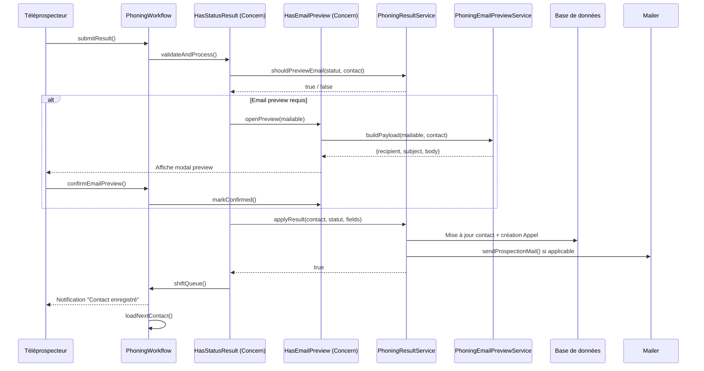
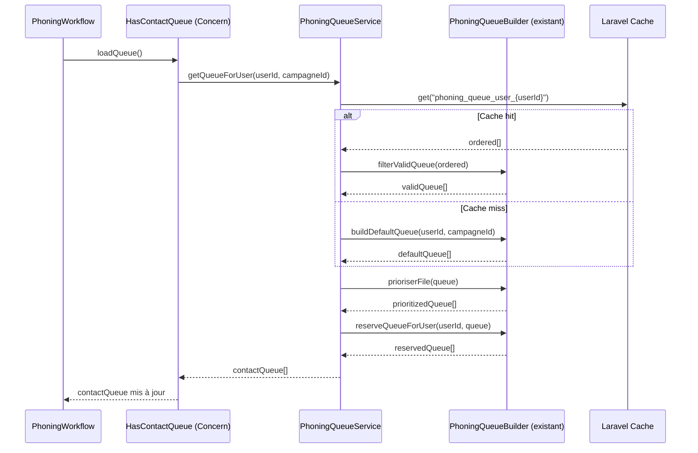

# Document de Design : Refactoring du Module Phoning

## Overview

Le module phoning (prospection téléphonique CSE) est actuellement concentré dans deux
fichiers devenus critiquement volumineux : `PhoningWorkflow.php` (page Livewire principale,
~600+ lignes) et `phoning-workflow.blade.php` (template Blade, ~3 000+ lignes de HTML,
CSS inline et Alpine.js). Ce refactoring les décompose en couches bien séparées —
Concerns Livewire, Services PHP, Actions Filament, composants Blade et feuilles CSS
dédiées — sans modifier aucun comportement visible ni casser les tests existants.

Le back-office `PhoningBackOffice.php` bénéficie du même traitement : extraction d'un
Concern de gestion de file et d'un composant Blade pour le tableau triable.

L'objectif final est qu'aucun fichier PHP de présentation ne dépasse 200 lignes et
qu'aucun template Blade ne dépasse 300 lignes.


---

## Architecture

### Vue d'ensemble des couches

```mermaid
graph TD
    subgraph "Couche Présentation (Filament/Livewire)"
        PW[PhoningWorkflow.php<br/>≤200 lignes]
        PBO[PhoningBackOffice.php<br/>≤150 lignes]
    end

    subgraph "Concerns Livewire"
        HC[HasContactQueue]
        HCS[HasCallSession]
        HEP[HasEmailPreview]
        HSR[HasStatusResult]
        HQM[HasQueueManagement]
    end

    subgraph "Services PHP"
        PQS[PhoningQueueService]
        PRS[PhoningResultService]
        PES[PhoningEmailPreviewService]
        RS[RingoverService<br/>existant]
    end

    subgraph "Actions Filament"
        SCA[SubmitCallResultAction]
        SEA[SendEmailPreviewAction]
        NCA[NextContactAction]
    end

    subgraph "Couche Vue (Blade)"
        WB[phoning-workflow.blade.php<br/>≤300 lignes]
        BB[phoning-back-office.blade.php<br/>≤300 lignes]
        CP[components/phoning/contact-panel.blade.php]
        SP[components/phoning/status-panel.blade.php]
        EP[components/phoning/email-preview.blade.php]
        RW[components/phoning/ringover-widget.blade.php]
        QT[components/phoning/queue-table.blade.php]
    end

    subgraph "Assets CSS"
        PWC[phoning-workflow.css]
        PBOC[phoning-back-office.css]
    end

    PW --> HC & HCS & HEP & HSR
    PBO --> HQM

    HC --> PQS
    HCS --> RS
    HEP --> PES
    HSR --> PRS

    PW --> SCA & SEA & NCA

    WB --> CP & SP & EP & RW
    BB --> QT

    WB -.->|@vite| PWC
    BB -.->|@vite| PBOC
```


### Diagramme de séquence — Enregistrement d'un résultat d'appel




### Diagramme de séquence — Chargement de la file d'appels




---

## Components and Interfaces

### Concern 1 : HasContactQueue

**Objectif** : Gérer la file d'appels (chargement, navigation, priorité, recherche).

**Namespace** : `App\Filament\NsConseil\Concerns`

**Interface PHP** :
```php
trait HasContactQueue
{
    // État Livewire
    public array  $contactQueue    = [];
    public ?int   $currentCampagneId = null;
    public ?int   $campagneFiltreId  = null;
    public int    $progress        = 0;
    public int    $total           = 0;
    public int    $completed       = 0;
    public string $searchQuery     = '';
    public array  $searchResults   = [];
    public bool   $showSearchResults = false;

    // Méthodes publiques (appelables depuis Livewire / Blade)
    public function loadQueue(): void;
    public function refreshQueue(): void;
    public function loadNextContact(): void;
    public function selectSearchResult(int $id, string $type): void;
    public function clearSearch(): void;
    public function updatedSearchQuery(): void;

    // Méthodes protégées
    protected function ensureRequestedContactPriority(): void;
    protected function buildDefaultQueue(int $userId): array;
    protected function filterValidQueue(array $queue): array;
    protected function prioriserFile(array $queue): array;
}
```

**Responsabilités** :
- Charger / rafraîchir la file via `PhoningQueueService`
- Naviguer vers le contact suivant (`loadNextContact`)
- Gérer la recherche live de contacts (`searchContacts`, `selectSearchResult`)
- Calculer la progression (`progress`, `total`, `completed`)

---

### Concern 2 : HasCallSession

**Objectif** : Gérer la session d'appel Ringover (initiation, lifecycle, appels entrants).

**Namespace** : `App\Filament\NsConseil\Concerns`

```php
trait HasCallSession
{
    public ?string $ringoverCallId        = null;
    public ?string $ringoverCallStartedAt = null;
    public ?string $ringoverCallEndedAt   = null;
    public array   $incomingCallMatches   = [];
    public ?string $incomingCallPhone     = null;
    public ?int    $supervisedUserId      = null;
    public bool    $isSupervisorMode      = false;

    public function callNow(): void;
    public function selectSupervisedUser(int $userId): void;
    public function resetToSelf(): void;

    #[On('ringover-call-lifecycle')]
    public function updateRingoverCallLifecycle(
        ?string $callId     = null,
        ?string $startedAt  = null,
        ?string $endedAt    = null
    ): void;

    #[On('search-incoming-call')]
    public function searchIncomingCallMatch(
        string $phone,
        ?string $targetType = null,
        ?int    $targetId   = null
    ): void;
}
```

**Responsabilités** :
- Déclencher un appel Ringover (`dispatch('ringover-call', phone: $num)`)
- Recevoir et stocker les événements du cycle de vie Ringover
- Gérer la détection/association d'appels entrants
- Gérer le mode supervision (changer d'agent à superviser)


---

### Concern 3 : HasEmailPreview

**Objectif** : Gérer l'aperçu et la confirmation d'envoi des emails de prospection.

```php
trait HasEmailPreview
{
    public bool    $showEmailPreview          = false;
    public bool    $emailPreviewConfirmed     = false;
    public ?string $emailPreviewRecipient     = null;
    public ?string $emailPreviewSubject       = null;
    public ?string $emailPreviewBody          = null;
    public ?string $emailPreviewOriginalSubject = null;
    public ?string $emailPreviewOriginalBody    = null;

    public function confirmEmailPreview(): void;
    public function cancelEmailPreview(): void;
    public function syncEmailPreviewContent(
        string  $subject,
        string  $body,
        ?string $recipient = null
    ): void;

    protected function openEmailPreview(): void;
    protected function resetEmailPreviewState(): void;
    protected function getEmailPreviewPayload(): ?array; // délègue à PhoningEmailPreviewService
}
```

**Responsabilités** :
- Construire le payload preview via `PhoningEmailPreviewService`
- Exposer les propriétés Livewire bindées dans le composant Blade `email-preview`
- Gérer la confirmation/annulation avant envoi réel

---

### Concern 4 : HasStatusResult

**Objectif** : Valider et persister le résultat d'un appel.

```php
trait HasStatusResult
{
    public string $statut_resultat            = '';
    public string $commentaires               = '';
    public string $rappel_date                = '';
    public string $rappel_heure               = '';

    // Champs interlocuteur (prospect)
    public string $nom_interlocuteur_standard = '';
    public string $interlocuteur_nom          = '';
    public string $interlocuteur_fonction     = '';
    public string $interlocuteur_telephone    = '';
    public string $interlocuteur_email        = '';
    // … autres champs formulaire fiche bleue / verte

    public function submitResult(): void;
    public function updatedStatutResultat(): void;

    public function getStatusValidationCodes(): array;
    public function commentaireRequis(): bool;
    public function messageCommentaireObligatoire(): string;

    protected function validateResultForm(): void;
    protected function applyContactUpdate(): void;   // dispatch selon contactType
    protected function enregistrerAppel(): void;
    protected function getResultLabel(): string;
    protected function checkCampagneCompletion(): void;
    protected function dispatchFicheGenerationJob(): void;
}
```

---

### Concern 5 : HasQueueManagement (PhoningBackOffice)

**Objectif** : Gérer la réorganisation de file côté back-office superviseur.

```php
trait HasQueueManagement
{
    public array  $prospectList  = [];
    public array  $selectedIds   = [];
    public string $filterStatut  = '';
    public string $filterDept    = '';
    public bool   $filterRappelOnly = false;

    public function loadProspects(): void;
    public function reorderFromDrag(array $orderedIds): void;
    public function moveUp(int $prospectId): void;
    public function moveDown(int $prospectId): void;
    public function moveToTop(int $prospectId): void;
    public function moveToBottom(int $prospectId): void;
    public function moveSelectedToTop(): void;
    public function removeSelected(): void;
    public function resetOrder(): void;
    public function applyFilters(): void;
    public function clearFilters(): void;

    protected function saveQueue(): void;
    protected function formatProspect(Prospect $p): array;
    protected function applyFiltersToCollection(Collection $col): Collection;
    protected function findIndex(int $prospectId): ?int;
}
```


---

## Data Models

### PhoningQueueService (nouveau service orchestrateur)

Ce service orchestre `PhoningQueueBuilder` (déjà existant) et centralise la logique
de cache qui est aujourd'hui éparpillée dans les pages.

```php
namespace App\Services\Phoning;

class PhoningQueueService
{
    public function __construct(
        private PhoningQueueBuilder       $builder,
        private PhoningContactSearchService $search
    ) {}

    /**
     * Retourne la file prête à l'emploi pour un user.
     * Encapsule : lecture cache → buildDefaultQueue → prioriserFile → reserve.
     */
    public function getQueueForUser(int $userId, ?int $campagneId = null): array;

    /**
     * Persiste l'ordre modifié en cache.
     */
    public function saveQueueForUser(int $userId, array $queue): void;

    /**
     * Vide la clé cache (reset ordre).
     */
    public function clearQueueForUser(int $userId): void;

    /**
     * Recherche de contacts (délègue à PhoningContactSearchService).
     */
    public function search(string $query): array;
    public function findByPhone(string $phone): array;
}
```

**Règles de validation** :
- `userId` doit être un entier positif existant en base
- `campagneId` nullable ; si fourni, la file est restreinte à cette campagne
- La clé cache est `phoning_queue_user_{userId}` avec TTL 24 h

---

### PhoningResultService (nouveau service de persistance)

Extrait la logique `updateProspect`, `updateArtisan`, `updatePartenaire`, etc. de `PhoningWorkflow`.

```php
namespace App\Services\Phoning;

class PhoningResultService
{
    /**
     * Applique le résultat de l'appel sur le modèle contact (update statut,
     * interlocuteur, rappel, etc.) et crée l'enregistrement Appel.
     *
     * @param  Model  $contact       Instance Eloquent (Prospect, Artisan, etc.)
     * @param  string $type          'prospect' | 'artisan' | 'partenaire' | …
     * @param  string $statut        Code statut phoning validé
     * @param  array  $fields        Champs du formulaire (commentaires, rappel_date, …)
     * @return Appel                 L'enregistrement Appel créé
     */
    public function applyResult(
        Model  $contact,
        string $type,
        string $statut,
        array  $fields
    ): Appel;

    /**
     * Détermine si l'appel avec ce statut nécessite un aperçu email.
     */
    public function shouldPreviewEmail(string $statut, string $contactType): bool;

    /**
     * Retourne le label lisible d'un code statut.
     */
    public function getStatutLabel(string $statut, string $contactType): string;

    /**
     * Vérifie si un commentaire est obligatoire pour ce statut.
     */
    public function isCommentRequired(string $statut, string $contactType): bool;
}
```

---

### PhoningEmailPreviewService (nouveau service)

Extrait la construction du payload email de `PhoningWorkflow`.

```php
namespace App\Services\Phoning;

class PhoningEmailPreviewService
{
    /**
     * Construit le payload {recipient, subject, body} pour l'aperçu.
     * Retourne null si ce statut ne déclenche pas d'email.
     */
    public function buildPayload(
        string   $statut,
        Prospect $contact,
        array    $formFields  // rappel_date, lieu_rdv, interlocuteur_*, …
    ): ?array;

    /**
     * Crée le Mailable correspondant au statut.
     */
    public function makeMailable(string $statut, Prospect $contact, array $fields): ?Mailable;

    /**
     * Résout le destinataire principal pour l'aperçu.
     */
    public function resolveRecipient(string $statut, Prospect $contact): ?string;
}
```


---

## Pseudocode algorithmique formel

### Algorithme principal : submitResult()

```pascal
PROCEDURE submitResult()
    INPUT: état Livewire (this.currentContact, this.statut_resultat, this.commentaires, …)
    OUTPUT: aucun (effets de bord : DB, notifications, mise à jour queue)

    PRECONDITION: this.currentContact ≠ null
    PRECONDITION: this.statut_resultat ∈ getStatusValidationCodes()

    BEGIN
        // 1. Validation du formulaire
        CALL validateResultForm()
        IF validation échoue THEN
            RETURN  // Livewire affiche les erreurs inline
        END IF

        // 2. Email preview si nécessaire
        IF PhoningResultService.shouldPreviewEmail(statut_resultat, contactType)
           AND NOT emailPreviewConfirmed THEN
            CALL openEmailPreview()
            RETURN  // On attend la confirmation de l'utilisateur
        END IF

        IF showEmailPreview AND emailPreviewConfirmed THEN
            showEmailPreview ← false
        END IF

        // 3. Persistance
        appel ← PhoningResultService.applyResult(
            currentContact, contactType, statut_resultat, collectFormFields()
        )

        // 4. Génération fiches Word
        CALL dispatchFicheGenerationJob()
        IF contactType = 'prospect' THEN
            TRY
                CALL FicheGenerationService.genererAutoParStatut(statut_resultat, currentContact)
            CATCH Throwable → ignorer (ne pas bloquer)
            END TRY
        END IF

        // 5. Notification succès
        NOTIFY 'Contact enregistré' WITH getResultLabel()

        // 6. Libérer la réservation cache
        PhoningQueueBuilder.releaseQueueReservationForUser(Auth.id, contactType, currentContact.id)

        // 7. Avancer dans la file
        CALL resetEmailPreviewState()
        REMOVE first element FROM contactQueue
        INCREMENT completed BY 1
        CALL checkCampagneCompletion()
        CALL loadNextContact()

    POSTCONDITION: contactQueue[0] est le prochain contact (ou file vide)
    POSTCONDITION: appel a été créé en base
    END
```

**Invariants de boucle** : N/A (pas de boucle dans cette procédure)

**Préconditions** :
- `currentContact` est non-null et chargé
- `statut_resultat` appartient aux codes validés pour `contactType`
- Si `emailPreviewConfirmed = true`, `emailPreviewSubject` et `emailPreviewBody` sont non vides

**Postconditions** :
- Un enregistrement `Appel` a été créé avec le bon `phoning_status`
- Le contact a son statut mis à jour selon les règles métier du statut phoning
- La file a avancé d'un cran (ou est vide)
- L'aperçu email a été réinitialisé

---

### Algorithme : getQueueForUser() dans PhoningQueueService

```pascal
ALGORITHM getQueueForUser(userId, campagneId)
    INPUT: userId ∈ ℕ⁺, campagneId ∈ ℕ⁺ | null
    OUTPUT: queue[] (tableau ordonné d'entrées {type, id, campagne_id})

    PRECONDITION: userId > 0
    PRECONDITION: User.exists(userId) = true

    BEGIN
        cacheKey ← "phoning_queue_user_" + userId
        cached ← Cache.get(cacheKey)

        IF cached ≠ null THEN
            queue ← PhoningQueueBuilder.filterValidQueue(cached)
        ELSE
            queue ← PhoningQueueBuilder.buildDefaultQueue(userId, campagneId)
        END IF

        queue ← PhoningQueueBuilder.prioriserFile(queue)
        queue ← PhoningQueueBuilder.reserveQueueForUser(userId, queue)

        RETURN queue
    END

    POSTCONDITION: ∀ item ∈ result : item.type ∈ {'prospect','artisan','partenaire','client'}
    POSTCONDITION: ∀ item ∈ result : item.id > 0
    POSTCONDITION: rappels en retard OU du jour sont en tête de file
```

---

### Algorithme : buildPayload() dans PhoningEmailPreviewService

```pascal
ALGORITHM buildPayload(statut, contact, formFields)
    INPUT: statut ∈ String, contact ∈ Prospect, formFields ∈ Array
    OUTPUT: payload{recipient, subject, body} | null

    PRECONDITION: contact ≠ null
    PRECONDITION: statut ∈ {'rdv', 'bloc', 'ncse_50', 'cse_hz'}  // statuts déclencheurs email

    BEGIN
        mailable ← makeMailable(statut, contact, formFields)

        IF mailable = null THEN
            RETURN null
        END IF

        recipient ← resolveRecipient(statut, contact)

        subject ← getMailableSubject(mailable)
        body    ← getMailableBody(mailable)

        RETURN {
            recipient: recipient ?? '',
            subject:   subject,
            body:      body
        }
    END

    POSTCONDITION: result.subject ≠ ''
    POSTCONDITION: strip_tags(result.body) ≠ ''
    POSTCONDITION: IF statut ∉ statuts_email THEN result = null
```


---

## Fonctions clés avec spécifications formelles

### PhoningWorkflow.php (après refactoring)

```php
namespace App\Filament\NsConseil\Pages;

class PhoningWorkflow extends Page
{
    use HasContactQueue;   // file, navigation, recherche
    use HasCallSession;    // Ringover, supervision
    use HasEmailPreview;   // aperçu / confirmation email
    use HasStatusResult;   // validation + persistance résultat
    use HasRoleAccess;     // contrôle d'accès existant

    protected static string $view = 'filament.ns-conseil.pages.phoning-workflow';

    /** Initialise la session : mode superviseur, campagne URL, file. */
    public function mount(): void;

    /** Retourne les actions du header (header Filament). */
    protected function getHeaderActions(): array;

    /** Retourne les actions du footer/toolbar. */
    protected function getFooterActions(): array;
}
```

**Précondition `mount()`** : utilisateur authentifié  
**Postcondition `mount()`** : `contactQueue` est chargé, `currentContact` est défini ou null si file vide

---

### PhoningBackOffice.php (après refactoring)

```php
class PhoningBackOffice extends Page
{
    use HasQueueManagement;
    use HasRoleAccess;

    protected static string $view = 'filament.ns-conseil.pages.phoning-back-office';

    public ?int $selectedUserId = null;

    public function mount(): void;
    public function selectUser(int $userId): void;

    public function getTeleprospecteurs(): array;
    public function getSelectedUser(): ?array;

    protected function queryTeleprospecteurs(): Builder;
    protected function getHeaderActions(): array;
}
```

---

## Découpage des composants Blade

### Structure des fichiers

```
resources/views/
└── filament/ns-conseil/pages/
    ├── phoning-workflow.blade.php        (≤300 lignes — orchestrateur)
    └── phoning-back-office.blade.php     (≤300 lignes — orchestrateur)

resources/views/components/phoning/
    ├── contact-panel.blade.php           (carte identité entreprise + barre contact)
    ├── status-panel.blade.php            (onglets cas + chips statuts + rappel box)
    ├── email-preview.blade.php           (modal aperçu email éditable)
    ├── ringover-widget.blade.php         (iframe + boîte NR + infos appel entrant)
    └── queue-table.blade.php             (tableau triable SortableJS — back-office)

resources/css/
    ├── phoning-workflow.css              (styles extraits du blade workflow)
    └── phoning-back-office.css          (styles extraits du blade back-office)
```

### Interface de chaque composant Blade

**contact-panel** (reçoit les données formatées du contact courant) :
```blade
{{-- @props(['contact', 'contactType', 'queueCount', 'progress', 'isSupervisorMode']) --}}
<x-phoning::contact-panel
    :contact="$currentContactData"
    :contact-type="$contactType"
    :queue-count="count($contactQueue)"
    :progress="$progress"
    :is-supervisor-mode="$isSupervisorMode"
/>
```

**status-panel** (reçoit statuts et valeurs du formulaire) :
```blade
{{-- @props(['statuts', 'selectedStatut', 'commentaires', 'rappelDate', 'rappelHeure']) --}}
<x-phoning::status-panel
    :statuts="$this->getStatutsForContact()"
    wire:model="statut_resultat"
/>
```

**email-preview** (conditional, contrôlé par HasEmailPreview) :
```blade
@if($showEmailPreview)
<x-phoning::email-preview
    wire:model.live="emailPreviewSubject"
    :body="$emailPreviewBody"
    :recipient="$emailPreviewRecipient"
/>
@endif
```

**ringover-widget** :
```blade
<x-phoning::ringover-widget
    :phone="$currentContactData['telephone'] ?? null"
    :nr-count="$tentativesActuelles"
    :max-nr="$maxTentatives"
    :call-id="$ringoverCallId"
/>
```

**queue-table** (back-office) :
```blade
<x-phoning::queue-table
    :prospects="$prospectList"
    wire:model="selectedIds"
/>
```


---

## Error Handling

### Scénario 1 : Échec de persistance du résultat d'appel

**Condition** : Exception DB lors de `PhoningResultService::applyResult()`  
**Réponse** : Catch dans `HasStatusResult::submitResult()`, notification danger  
**Récupération** : La file n'avance pas (`array_shift` n'est pas exécuté), l'utilisateur peut réessayer

### Scénario 2 : Contact disparu de la base en cours de session

**Condition** : `PhoningContactResolver::resolveModel()` retourne null  
**Réponse** : Skip silencieux du contact (`array_shift` + appel récursif `loadNextContact`)  
**Récupération** : Contact suivant chargé automatiquement

### Scénario 3 : Mailable invalide pour l'aperçu email

**Condition** : `PhoningEmailPreviewService::buildPayload()` retourne null  
**Réponse** : Bypass silencieux de l'étape aperçu, envoi direct  
**Récupération** : Workflow continue sans interruption

### Scénario 4 : Génération de fiche Word échoue

**Condition** : `FicheGenerationService::genererAutoParStatut()` lève `Throwable`  
**Réponse** : Catch sans rethrow (ne bloque pas le workflow), aucune notification  
**Récupération** : Résultat d'appel déjà sauvegardé, seule la fiche est manquante

### Scénario 5 : File vide après filtrage

**Condition** : `PhoningQueueBuilder::filterValidQueue()` retourne `[]`  
**Réponse** : `loadNextContact()` set `currentContact = null`, notification info  
**Récupération** : Affichage de l'écran "File vide" avec bouton Rafraîchir

---

## Correctness Properties

*A property is a characteristic or behavior that should hold true across all valid executions of a system — essentially, a formal statement about what the system should do. Properties serve as the bridge between human-readable specifications and machine-verifiable correctness guarantees.*

Ces propriétés doivent rester vraies à tout moment.

### Property 1: Intégrité des éléments de la file

*For any* queue returned by `PhoningQueueService::getQueueForUser()`, every item must have `id > 0` and `type` belonging to `{'prospect','artisan','partenaire','client','particulier'}`.

`∀ item ∈ contactQueue : item.id > 0 ∧ item.type ∈ {'prospect','artisan','partenaire','client','particulier'}`

**Validates: Requirements 12.1**

### Property 2: Unicité dans la file

*For any* two distinct indices i, j in `contactQueue`, the pair `(type, id)` must differ.

`∀ i,j ∈ contactQueue : i ≠ j ⟹ (i.type, i.id) ≠ (j.type, j.id)`

**Validates: Requirements 12.2**

### Property 3: Progression cohérente

*For any* values of `completed` and `total` where `total > 0`, `progress` must equal `round(completed / total × 100)`, and `completed` must never exceed `total`.

`completed ≤ total` et si `total > 0` alors `progress = round(completed / total × 100)`

**Validates: Requirements 2.8, 12.3, 12.4**

### Property 4: Invariant preview conditionnelle

*For any* state sequence of confirm/cancel/open actions on `HasEmailPreview`, whenever `emailPreviewConfirmed` is `true`, `showEmailPreview` must be `false`.

`emailPreviewConfirmed = true ⟹ showEmailPreview = false`

**Validates: Requirements 4.7**

### Property 5: Résultat valide avant persistance

*For any* call to `PhoningResultService::applyResult()` with valid arguments, exactly one `Appel` record must be created in the database.

Avant tout appel à `PhoningResultService::applyResult()` :  
`statut_resultat ∈ StatutPhoning::where('model_type', contactType)->pluck('code')`

**Validates: Requirements 8.2, 8.3**

### Property 6: getQueueForUser() ne retourne jamais null

*For any* positive `userId` and any `campagneId` (including null), `PhoningQueueService::getQueueForUser()` must return an array and must never return null or throw an uncaught exception.

**Validates: Requirements 7.5**

### Property 7: shouldPreviewEmail() est total et booléen

*For any* `StatutPhoning` code and any `contactType`, `PhoningResultService::shouldPreviewEmail()` must return a boolean. It must return `true` if and only if the statut belongs to `{'rdv','bloc','ncse_50','cse_hz'}`.

**Validates: Requirements 8.5, 8.6**

### Property 8: buildPayload() — complétude du payload email

*For any* email-triggering statut, non-null contact, and form fields, `PhoningEmailPreviewService::buildPayload()` must return an array where `subject` is non-empty and `strip_tags(body)` is non-empty. For all other statuts it must return `null`.

**Validates: Requirements 9.2, 9.3, 9.4**

### Property 9: Résilience sur exception de persistance

*For any* exception thrown by `PhoningResultService::applyResult()`, `contactQueue` must remain identical to its state before the `submitResult()` call.

**Validates: Requirements 14.1**

### Property 10: Invariant de réservation cache

*For any* user's active queue, each contact in that queue possesses a cache key  
`phoning_queue_reservation_{type}_{id}` whose value equals `userId`.

**Validates: Requirements 7.6**

### Property 11: Réorganisation par drag-and-drop est une permutation

*For any* `prospectList` and any permutation `orderedIds` of its IDs, after `reorderFromDrag(orderedIds)` the resulting `prospectList` must be a permutation of the original list containing the same elements in the order specified by `orderedIds`.

**Validates: Requirements 6.4**

---

## Testing Strategy

### Tests unitaires

**Approach** : PHPUnit, isolation via mocks des services

| Classe testée | Test | Description |
|---|---|---|
| `PhoningQueueService` | `getQueueForUser_retourneFileCachee` | Cache hit → filterValidQueue appelé |
| `PhoningQueueService` | `getQueueForUser_construitFileParDefaut` | Cache miss → buildDefaultQueue |
| `PhoningResultService` | `applyResult_creeEnregistrementAppel` | Un `Appel` est créé avec le bon statut |
| `PhoningResultService` | `shouldPreviewEmail_vraiPourStatutsEmail` | rdv/bloc/ncse_50/cse_hz → true |
| `PhoningEmailPreviewService` | `buildPayload_retourneNullSiStatutSansEmail` | std_nr → null |
| `PhoningEmailPreviewService` | `buildPayload_retournePayloadComplet` | rdv → {recipient, subject, body} non vides |
| `HasStatusResult` | `getStatusValidationCodes_depuis_BDD` | ← tests existants conservés intacts |
| `HasEmailPreview` | `getEmailPreviewPayload_sansDestinataire` | ← tests existants conservés intacts |

### Tests property-based

**Librairie** : [roave/better-reflection](https://github.com/Roave/BetterReflection) / PHPUnit avec DataProvider

**Propriété 1** : Pour tout `statut ∈ StatutPhoning`, `shouldPreviewEmail(statut)` retourne toujours un booléen  
**Propriété 2** : `getQueueForUser(userId)` retourne toujours un tableau (jamais null, jamais exception)  
**Propriété 3** : `formatProspect(Prospect)` retourne toujours un tableau avec les clés `['id', 'nom', 'statut', 'telephone']`

### Tests d'intégration

- `PhoningWorkflow::mount()` ne lève pas d'exception si la file est vide
- `PhoningBackOffice::loadProspects()` retourne un tableau vide sans erreur si pas de téléprospecteur sélectionné
- Le composant Blade `contact-panel` se rend sans erreur avec un tableau de données minimal

---

## Considérations de performance

- Le refactoring ne modifie pas la logique de cache existante (`phoning_queue_user_{userId}`, TTL 24 h)
- Les Concerns Livewire ne déclenchent pas de requêtes DB supplémentaires
- Les composants Blade anonymes (`x-phoning::*`) sont compilés une seule fois par Blade
- L'extraction CSS dans des fichiers dédiés réduit la taille des réponses Livewire (le style n'est plus inline dans le HTML)
- Les `@push('styles')` / `@push('scripts')` sont remplacés par des imports Vite pour bénéficier du fingerprinting navigateur

---

## Considérations de sécurité

- Le trait `HasRoleAccess` reste en place sur les deux pages, aucune régression d'autorisation
- Les méthodes publiques exposées via Livewire dans les Concerns ne permettent pas d'accès à des données hors du scope de l'utilisateur courant
- `PhoningResultService::applyResult()` vérifie que le contact appartient bien à la file de l'utilisateur avant la mise à jour

---

## Dépendances

| Dépendance | Type | Usage |
|---|---|---|
| `laravel/framework` ^11 | Existante | Cache, Mail, Eloquent |
| `filament/filament` ^3 | Existante | Pages, Actions, Notifications |
| `livewire/livewire` ^3 | Existante | Traits, attributs `#[On]` |
| `SortableJS` 1.15 | CDN existante | Drag & drop dans queue-table |
| `vite` | Existante | Compilation CSS dédiée |
| Aucune nouvelle dépendance externe | — | Le refactoring n'ajoute aucun package |

---

## Plan de migration (ordre d'exécution recommandé)

```pascal
SEQUENCE migration
    1. Extraire HasContactQueue + PhoningQueueService (tests verts)
    2. Extraire HasCallSession (pas de changement DB)
    3. Extraire PhoningResultService + HasStatusResult (tests critiques)
    4. Extraire PhoningEmailPreviewService + HasEmailPreview (tests preview)
    5. Extraire HasQueueManagement pour PhoningBackOffice
    6. Découper phoning-workflow.blade.php en composants Blade
    7. Découper phoning-back-office.blade.php
    8. Extraire CSS → fichiers dédiés + Vite
    9. Supprimer le code mort dans les pages sources
    10. Passer tous les tests (existants + nouveaux)
END SEQUENCE
```

Chaque étape doit passer en vert avant de passer à la suivante.
