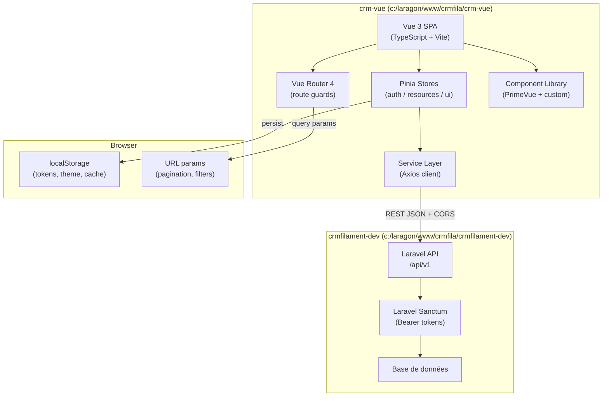
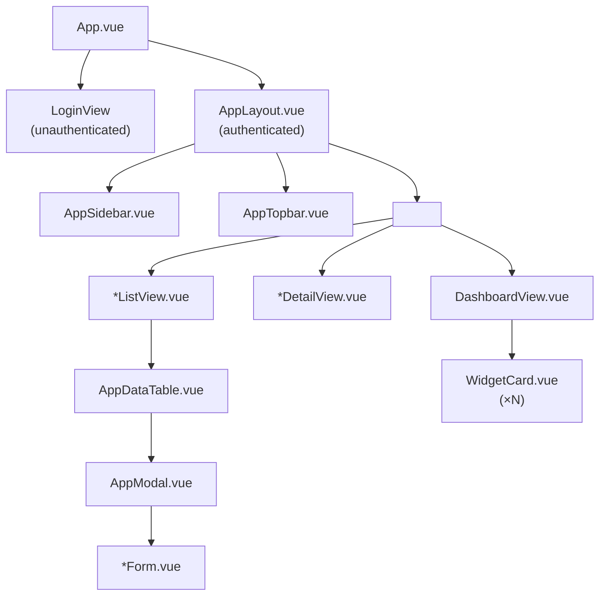
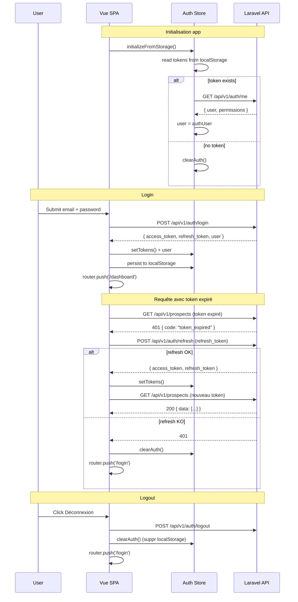
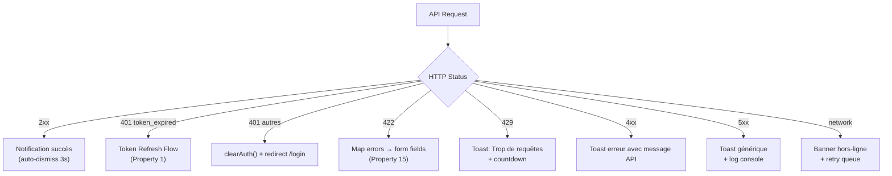

# Design Document — Vue.js Frontend CRM

## Overview

Ce document décrit l'architecture technique du frontend Vue.js 3 du CRM AOPIA. L'application est une Single Page Application (SPA) entièrement découplée du backend Laravel, hébergée dans le projet séparé `crm-vue` (`c:\laragon\www\crmfila\crm-vue`). Elle consomme l'API REST `/api/v1` exposée par le backend `crmfilament-dev` via Laravel Sanctum.

**Choix technologiques clés :**
- Vue 3 + Composition API + TypeScript (typage strict)
- Vite (build tool, HMR)
- Pinia (state management)
- Vue Router 4 (navigation, guards)
- PrimeVue 4 (composants UI — cohérence visuelle avec l'esthétique Filament/Tailwind)
- Axios (client HTTP, interceptors)
- Vitest + Vue Test Utils (tests unitaires et composants)
- vue-i18n (internationalisation, locale fr-FR par défaut)
- VeeValidate + Zod (validation de formulaires)

---

## Architecture

### Vue d'ensemble système



### Séparation frontend / backend

```
crm-vue/              ← Projet indépendant (ce dépôt)
  src/
  package.json
  vite.config.ts
  .env               ← VITE_API_BASE_URL=http://localhost/api/v1

crmfilament-dev/      ← Projet backend (dépôt séparé)
  app/
  routes/api.php     ← /api/v1 endpoints
  config/cors.php    ← CORS autorise http://localhost:5173
```

Les deux projets ne partagent aucun code source. La communication se fait uniquement par HTTP/JSON sur `/api/v1`. Les tokens Sanctum sont stockés côté client dans `localStorage`.

---

## Components and Interfaces

### Structure des dossiers (`crm-vue/src/`)

```
src/
├── assets/                    # Images, polices, CSS global
│   ├── styles/
│   │   ├── main.css           # Variables CSS, reset
│   │   └── themes/
│   │       ├── light.css
│   │       └── dark.css
│   └── images/
│
├── components/                # Composants réutilisables
│   ├── common/
│   │   ├── AppDataTable.vue   # Tableau générique avec sort/filter/pagination
│   │   ├── AppModal.vue       # Dialog modal réutilisable
│   │   ├── AppBadge.vue       # Badge statut coloré
│   │   ├── AppConfirm.vue     # Dialogue de confirmation
│   │   └── AppLoading.vue     # Skeleton / Spinner overlay
│   ├── layout/
│   │   ├── AppLayout.vue      # Layout principal (sidebar + topbar)
│   │   ├── AppSidebar.vue     # Menu navigation latéral
│   │   ├── AppTopbar.vue      # Barre supérieure
│   │   └── AppBreadcrumb.vue  # Fil d'Ariane
│   ├── forms/
│   │   ├── ProspectForm.vue
│   │   ├── PartenaireForm.vue
│   │   ├── RendezVousForm.vue
│   │   ├── AppelForm.vue
│   │   ├── TicketForm.vue
│   │   └── ReclamationForm.vue
│   └── dashboard/
│       ├── WidgetCard.vue
│       ├── WidgetAppelsDuJour.vue
│       ├── WidgetProspectsARappeler.vue
│       ├── WidgetRendezVousDuJour.vue
│       └── WidgetKpiGlobaux.vue
│
├── views/                     # Pages (un fichier par route)
│   ├── auth/
│   │   └── LoginView.vue
│   ├── dashboard/
│   │   └── DashboardView.vue
│   ├── prospects/
│   │   ├── ProspectsListView.vue
│   │   └── ProspectDetailView.vue
│   ├── partenaires/
│   │   ├── PartenairesListView.vue
│   │   └── PartenaireDetailView.vue
│   ├── appels/
│   │   └── AppelsListView.vue
│   ├── rendez-vous/
│   │   ├── RendezVousListView.vue
│   │   └── RendezVousCalendarView.vue
│   ├── tickets/
│   │   ├── TicketsListView.vue
│   │   └── TicketDetailView.vue
│   ├── reclamations/
│   │   ├── ReclamationsListView.vue
│   │   └── ReclamationDetailView.vue
│   ├── clients/
│   │   ├── ClientsListView.vue
│   │   └── ClientDetailView.vue
│   ├── devis/
│   │   ├── DevisListView.vue
│   │   └── DevisDetailView.vue
│   ├── bons-commande/
│   │   ├── BonsCommandeListView.vue
│   │   └── BonCommandeDetailView.vue
│   ├── campagnes/
│   │   ├── CampagnesListView.vue
│   │   └── CampagneDetailView.vue
│   └── errors/
│       ├── NotFoundView.vue
│       └── ForbiddenView.vue
│
├── stores/                    # Pinia stores
│   ├── auth.store.ts
│   ├── prospects.store.ts
│   ├── partenaires.store.ts
│   ├── rendezVous.store.ts
│   ├── tickets.store.ts
│   ├── reclamations.store.ts
│   ├── clients.store.ts
│   ├── campagnes.store.ts
│   └── ui.store.ts
│
├── services/                  # Couche API
│   ├── api.client.ts          # Instance Axios configurée
│   ├── auth.service.ts
│   ├── prospects.service.ts
│   ├── partenaires.service.ts
│   ├── rendezVous.service.ts
│   ├── tickets.service.ts
│   ├── reclamations.service.ts
│   ├── clients.service.ts
│   ├── campagnes.service.ts
│   └── search.service.ts
│
├── composables/               # Logique réutilisable (hooks)
│   ├── useAuth.ts
│   ├── useDataTable.ts        # Pagination/tri/filtres
│   ├── useFormValidator.ts
│   ├── useNotifications.ts
│   ├── usePermissions.ts
│   ├── useTheme.ts
│   ├── useDebounce.ts
│   └── useOffline.ts
│
├── types/                     # TypeScript interfaces et enums
│   ├── api.types.ts           # Réponses API génériques
│   ├── auth.types.ts
│   ├── prospect.types.ts
│   ├── partenaire.types.ts
│   ├── rendezVous.types.ts
│   ├── ticket.types.ts
│   ├── reclamation.types.ts
│   ├── client.types.ts
│   ├── campagne.types.ts
│   └── enums.ts               # Enums TypeScript miroir des PHP enums
│
├── router/
│   └── index.ts               # Vue Router + guards
│
├── locales/
│   └── fr.json                # Toutes les traductions FR
│
├── utils/
│   ├── enum.utils.ts          # Helpers enum → label/couleur
│   ├── date.utils.ts          # Formatage dates FR
│   └── validators.ts          # Fonctions de validation pures
│
├── App.vue
└── main.ts
```

### Hiérarchie des composants



---

## Data Models

### Types TypeScript (miroir des modèles Laravel)

```typescript
// types/api.types.ts
export interface PaginatedResponse<T> {
  data: T[]
  meta: {
    current_page: number
    last_page: number
    per_page: number
    total: number
    from: number
    to: number
  }
  links: {
    first: string | null
    last: string | null
    prev: string | null
    next: string | null
  }
}

export interface ApiError {
  message: string
  errors?: Record<string, string[]>  // Laravel 422 validation errors
  code?: string                       // e.g. "token_expired"
}

export interface TableQueryParams {
  page?: number
  per_page?: number
  sort_by?: string
  sort_dir?: 'asc' | 'desc'
  [key: string]: string | number | undefined  // filtres dynamiques
}
```

```typescript
// types/auth.types.ts
export interface AuthUser {
  id: number
  name: string
  email: string
  roles: string[]
  permissions: string[]
}

export interface AuthTokens {
  access_token: string
  refresh_token: string
  token_type: 'Bearer'
  expires_in: number
}

export interface LoginCredentials {
  email: string
  password: string
}

export interface AuthState {
  user: AuthUser | null
  accessToken: string | null
  refreshToken: string | null
  isAuthenticated: boolean
}
```

```typescript
// types/prospect.types.ts
export interface Prospect {
  id: number
  nom: string
  prenom: string | null
  entreprise: string | null
  telephone: string | null
  email: string | null
  statut: ProspectStatut
  commercial_id: number | null
  commercial?: { id: number; name: string }
  notes: string | null
  created_at: string
  updated_at: string
}

export interface ProspectCreatePayload {
  nom: string
  prenom?: string
  entreprise?: string
  telephone?: string
  email?: string
  statut?: ProspectStatut
  commercial_id?: number
  notes?: string
}
```

```typescript
// types/partenaire.types.ts
export interface Partenaire {
  id: number
  raison_sociale: string
  siret: string | null
  adresse: string | null
  telephone: string | null
  email: string | null
  type_organisation: OrganizationType
  statut: OrganizationStatus
  categorie: OrganizationCategory | null
  commercial_id: number | null
  commercial?: { id: number; name: string }
  created_at: string
  updated_at: string
}
```

```typescript
// types/rendezVous.types.ts
export interface RendezVous {
  id: number
  titre: string
  date_debut: string   // ISO 8601
  date_fin: string     // ISO 8601
  type: RendezVousType
  statut: RendezVousStatut
  partenaire_id: number
  partenaire?: { id: number; raison_sociale: string }
  commercial_id: number
  commercial?: { id: number; name: string }
  notes: string | null
  created_at: string
  updated_at: string
}
```

```typescript
// types/ticket.types.ts
export interface Ticket {
  id: number
  numero: string
  titre: string
  description: string
  priorite: NiveauPriorite
  statut: TicketStatut
  client_id: number | null
  client?: { id: number; nom: string; prenom: string }
  assigne_id: number | null
  assigne?: { id: number; name: string }
  created_at: string
  updated_at: string
}
```

```typescript
// types/enums.ts — miroir complet des PHP enums
export enum ProspectStatut {
  AC = 'AC',
  STD_NR = 'STD_NR',
  STD_Joint = 'STD_Joint',
  CSE_NR = 'CSE_NR',
  RP = 'RP',
  RPC = 'RPC',
  KO = 'KO',
  QF = 'QF',
}

export enum EventResult {
  Realise = 'Réalisé',
  Annule = 'Annulé',
  Decale = 'Décalé',
  NonAbouti = 'Non abouti',
  Rappel = 'Rappel',
}

export enum RendezVousType {
  Appel = 'Appel',
  Permanence = 'Permanence',
  Presentation = 'Présentation',
  Intervention = 'Intervention',
}

export enum RendezVousStatut {
  Planifie = 'Planifié',
  Realise = 'Réalisé',
  Annule = 'Annulé',
  Decale = 'Décalé',
}

export enum TicketStatut {
  AppelRecu = 'appel_recu',
  EnQualification = 'en_qualification',
  FicheComplete = 'fiche_complete',
  FicheIncomplete = 'fiche_incomplete',
  UrgenceDetectee = 'urgence_detectee',
  RdvPlanifie = 'rdv_planifie',
  RappelPromis = 'rappel_promis',
  EnAttenteConfirmationArtisan = 'en_attente_confirmation_artisan',
  ArtisanConfirme = 'artisan_confirme',
  DevisEnAttente = 'devis_en_attente',
  DevisAccepte = 'devis_accepte',
  InterventionRealisee = 'intervention_realisee',
  FactureEmise = 'facture_emise',
  PaiementRecu = 'paiement_recu',
  ClotureSatisfait = 'cloture_satisfait',
  SuiviQualiteRequis = 'suivi_qualite_requis',
  ReclamationOuverte = 'reclamation_ouverte',
  P8EnTraitement = 'p8_en_traitement',
  DossierCloture = 'dossier_cloture',
}

export enum NiveauPriorite {
  Urgence = 'URGENCE',
  Prioritaire = 'PRIORITAIRE',
  Standard = 'STANDARD',
}

export enum OrganizationType {
  CSE = 'CSE',
  Syndicat = 'Syndicat',
  EntrepriseDirecte = 'Entreprise directe',
  Association = 'Association',
  PartenariatAnnule = 'Partenariat annulé',
}

export enum OrganizationStatus {
  AProspecter = 'a_prospecter',
  EnCoursProspection = 'en_cours_prospection',
  RdvEnCours = 'rdv_en_cours',
  SigneAccordCadre = 'signe_accord_cadre',
  ConventionEngagement = 'convention_engagement',
  Refus = 'refus',
}

export enum OrganizationCategory {
  Partenaires = 'partenaires',
  Artisans = 'artisans',
  Contrats = 'contrats',
  FichesProspection = 'fiches_prospection',
}

export enum StatutReclamation {
  Ouverte = 'ouverte',
  EnTraitement = 'en_traitement',
  ValideeSuperviseur = 'validee_superviseur',
  Cloturee = 'cloturee',
}

export enum StatutDevis {
  Brouillon = 'brouillon',
  Envoye = 'envoye',
  Accepte = 'accepte',
  Refuse = 'refuse',
  Expire = 'expire',
}

export enum StatutBonDeCommande {
  EnAttente = 'en_attente',
  Confirme = 'confirme',
  EnCours = 'en_cours',
  Realise = 'realise',
  Annule = 'annule',
}

export enum StatutCampagneProspection {
  AC = 'AC',
  NR = 'NR',
  RP = 'RP',
  OBJ = 'OBJ',
  SOC = 'SOC',
  HC = 'HC',
  KO = 'KO',
}
```

### Enum utilities (`utils/enum.utils.ts`)

```typescript
// Mappe chaque enum vers { label, color } — source unique pour tout le frontend
import type { ProspectStatut, TicketStatut, /* ... */ } from '@/types/enums'

export interface EnumMeta {
  label: string
  color: string  // Tailwind color name
  icon?: string
}

export const PROSPECT_STATUT_META: Record<ProspectStatut, EnumMeta> = {
  AC:        { label: 'À contacter',                    color: 'gray',   icon: 'pi pi-phone' },
  STD_NR:    { label: 'Standard non répondu',           color: 'orange', icon: 'pi pi-building' },
  STD_Joint: { label: 'Standard joint',                 color: 'blue',   icon: 'pi pi-check-circle' },
  CSE_NR:    { label: 'CSE non répondu',                color: 'amber',  icon: 'pi pi-users' },
  RP:        { label: 'Rappel planifié',                color: 'indigo', icon: 'pi pi-clock' },
  RPC:       { label: 'RDV à planifier / Qualifié',     color: 'teal',   icon: 'pi pi-calendar' },
  KO:        { label: 'Hors cible / Refus',             color: 'red',    icon: 'pi pi-times-circle' },
  QF:        { label: 'RDV qualifié',                   color: 'green',  icon: 'pi pi-check-circle' },
}

// Pattern identique pour tous les autres enums...

export function getEnumMeta<T extends string>(
  meta: Record<T, EnumMeta>,
  value: T
): EnumMeta {
  return meta[value] ?? { label: value, color: 'gray' }
}
```

---

## Pinia Stores Design

### Auth Store (`stores/auth.store.ts`)

```typescript
import { defineStore } from 'pinia'
import { ref, computed } from 'vue'
import type { AuthUser, AuthTokens, AuthState } from '@/types/auth.types'
import { authService } from '@/services/auth.service'
import router from '@/router'

const LS_KEY_ACCESS  = 'crm_access_token'
const LS_KEY_REFRESH = 'crm_refresh_token'

export const useAuthStore = defineStore('auth', () => {
  const user         = ref<AuthUser | null>(null)
  const accessToken  = ref<string | null>(localStorage.getItem(LS_KEY_ACCESS))
  const refreshToken = ref<string | null>(localStorage.getItem(LS_KEY_REFRESH))

  const isAuthenticated = computed(() => !!accessToken.value && !!user.value)

  function setTokens(tokens: AuthTokens) {
    accessToken.value  = tokens.access_token
    refreshToken.value = tokens.refresh_token
    localStorage.setItem(LS_KEY_ACCESS,  tokens.access_token)
    localStorage.setItem(LS_KEY_REFRESH, tokens.refresh_token)
  }

  function clearAuth() {
    user.value         = null
    accessToken.value  = null
    refreshToken.value = null
    localStorage.removeItem(LS_KEY_ACCESS)
    localStorage.removeItem(LS_KEY_REFRESH)
  }

  async function login(email: string, password: string) {
    const { tokens, authUser } = await authService.login({ email, password })
    setTokens(tokens)
    user.value = authUser
  }

  async function logout() {
    try { await authService.logout() } catch { /* ignore */ }
    clearAuth()
    router.push({ name: 'login' })
  }

  async function refreshAccessToken(): Promise<string> {
    if (!refreshToken.value) throw new Error('No refresh token')
    const tokens = await authService.refresh(refreshToken.value)
    setTokens(tokens)
    return tokens.access_token
  }

  async function initializeFromStorage() {
    if (!accessToken.value) return
    try {
      user.value = await authService.me()
    } catch {
      clearAuth()
    }
  }

  return {
    user, accessToken, refreshToken, isAuthenticated,
    login, logout, refreshAccessToken, initializeFromStorage, clearAuth,
  }
})
```

### Resource Store Pattern (exemple : `stores/prospects.store.ts`)

```typescript
import { defineStore } from 'pinia'
import { ref } from 'vue'
import type { Prospect, ProspectCreatePayload } from '@/types/prospect.types'
import type { PaginatedResponse, TableQueryParams } from '@/types/api.types'
import { prospectsService } from '@/services/prospects.service'

const CACHE_TTL_MS = 30_000

export const useProspectsStore = defineStore('prospects', () => {
  const items        = ref<Prospect[]>([])
  const current      = ref<Prospect | null>(null)
  const meta         = ref<PaginatedResponse<Prospect>['meta'] | null>(null)
  const loading      = ref(false)
  const lastFetchAt  = ref<number | null>(null)

  function isCacheValid() {
    return lastFetchAt.value !== null
      && Date.now() - lastFetchAt.value < CACHE_TTL_MS
  }

  async function fetchList(params: TableQueryParams, forceRefresh = false) {
    if (!forceRefresh && isCacheValid()) return
    loading.value = true
    try {
      const response = await prospectsService.list(params)
      items.value   = response.data
      meta.value    = response.meta
      lastFetchAt.value = Date.now()
    } finally {
      loading.value = false
    }
  }

  async function fetchOne(id: number) {
    loading.value = true
    try {
      current.value = await prospectsService.get(id)
    } finally {
      loading.value = false
    }
  }

  async function create(payload: ProspectCreatePayload) {
    const created = await prospectsService.create(payload)
    items.value.unshift(created)
    return created
  }

  async function update(id: number, payload: Partial<ProspectCreatePayload>) {
    const updated = await prospectsService.update(id, payload)
    const idx = items.value.findIndex(p => p.id === id)
    if (idx !== -1) items.value[idx] = updated
    if (current.value?.id === id) current.value = updated
    return updated
  }

  async function remove(id: number) {
    await prospectsService.delete(id)
    items.value = items.value.filter(p => p.id !== id)
  }

  return { items, current, meta, loading, fetchList, fetchOne, create, update, remove, isCacheValid }
})
```

### UI Store (`stores/ui.store.ts`)

```typescript
export const useUiStore = defineStore('ui', () => {
  const theme         = ref<'light' | 'dark'>(
    (localStorage.getItem('crm_theme') as 'light' | 'dark')
    ?? (window.matchMedia('(prefers-color-scheme: dark)').matches ? 'dark' : 'light')
  )
  const sidebarOpen   = ref(true)
  const notifications = ref<Notification[]>([])

  function toggleTheme() {
    theme.value = theme.value === 'light' ? 'dark' : 'light'
    localStorage.setItem('crm_theme', theme.value)
    document.documentElement.classList.toggle('dark', theme.value === 'dark')
  }

  function addNotification(n: Omit<Notification, 'id'>) { /* ... */ }
  function removeNotification(id: string) { /* ... */ }

  return { theme, sidebarOpen, notifications, toggleTheme, addNotification, removeNotification }
})
```

---

## API Client and Service Layer

### Axios Client (`services/api.client.ts`)

```typescript
import axios, { type AxiosInstance, type AxiosError, type InternalAxiosRequestConfig } from 'axios'
import { useAuthStore } from '@/stores/auth.store'

// Set up base instance
const apiClient: AxiosInstance = axios.create({
  baseURL: import.meta.env.VITE_API_BASE_URL ?? '/api/v1',
  timeout: 30_000,
  headers: {
    'Accept':       'application/json',
    'Content-Type': 'application/json',
  },
})

// Request deduplication map
const pendingRequests = new Map<string, AbortController>()

// Request interceptor — attach Bearer token
apiClient.interceptors.request.use((config: InternalAxiosRequestConfig) => {
  const auth = useAuthStore()
  if (auth.accessToken) {
    config.headers.Authorization = `Bearer ${auth.accessToken}`
  }

  // Deduplication: cancel previous identical request
  const key = `${config.method}:${config.url}`
  if (pendingRequests.has(key)) {
    pendingRequests.get(key)!.abort()
  }
  const controller = new AbortController()
  config.signal = controller.signal
  pendingRequests.set(key, controller)

  return config
})

// Response interceptor — token refresh + error handling
let isRefreshing = false
let failedQueue: Array<{ resolve: (token: string) => void; reject: (err: unknown) => void }> = []

function processQueue(error: unknown, token: string | null) {
  failedQueue.forEach(p => error ? p.reject(error) : p.resolve(token!))
  failedQueue = []
}

apiClient.interceptors.response.use(
  response => {
    const key = `${response.config.method}:${response.config.url}`
    pendingRequests.delete(key)
    return response
  },
  async (error: AxiosError) => {
    const originalRequest = error.config as InternalAxiosRequestConfig & { _retry?: boolean }

    if (
      error.response?.status === 401
      && (error.response.data as any)?.code === 'token_expired'
      && !originalRequest._retry
    ) {
      if (isRefreshing) {
        return new Promise((resolve, reject) => {
          failedQueue.push({ resolve, reject })
        }).then(token => {
          originalRequest.headers.Authorization = `Bearer ${token}`
          return apiClient(originalRequest)
        })
      }

      originalRequest._retry = true
      isRefreshing = true

      const auth = useAuthStore()
      try {
        const newToken = await auth.refreshAccessToken()
        processQueue(null, newToken)
        originalRequest.headers.Authorization = `Bearer ${newToken}`
        return apiClient(originalRequest)
      } catch (refreshError) {
        processQueue(refreshError, null)
        auth.clearAuth()
        window.location.href = '/login'
        return Promise.reject(refreshError)
      } finally {
        isRefreshing = false
      }
    }

    return Promise.reject(error)
  }
)

export default apiClient
```

### Service Layer Pattern (`services/prospects.service.ts`)

```typescript
import apiClient from './api.client'
import type { Prospect, ProspectCreatePayload } from '@/types/prospect.types'
import type { PaginatedResponse, TableQueryParams } from '@/types/api.types'

export const prospectsService = {
  list(params: TableQueryParams) {
    return apiClient.get<PaginatedResponse<Prospect>>('/prospects', { params })
      .then(r => r.data)
  },
  get(id: number) {
    return apiClient.get<{ data: Prospect }>(`/prospects/${id}`).then(r => r.data.data)
  },
  create(payload: ProspectCreatePayload) {
    return apiClient.post<{ data: Prospect }>('/prospects', payload).then(r => r.data.data)
  },
  update(id: number, payload: Partial<ProspectCreatePayload>) {
    return apiClient.put<{ data: Prospect }>(`/prospects/${id}`, payload).then(r => r.data.data)
  },
  delete(id: number) {
    return apiClient.delete(`/prospects/${id}`)
  },
  recordCall(id: number, payload: AppelPayload) {
    return apiClient.post(`/prospects/${id}/appel`, payload).then(r => r.data.data)
  },
}
```

### Retry avec backoff exponentiel (composable `useRetry`)

```typescript
export async function withRetry<T>(
  fn: () => Promise<T>,
  maxAttempts = 3,
  baseDelayMs = 500
): Promise<T> {
  let attempt = 0
  while (true) {
    try {
      return await fn()
    } catch (error: any) {
      attempt++
      // Ne pas retry les erreurs 4xx (sauf 429)
      const status = error?.response?.status
      if (status && status >= 400 && status < 500 && status !== 429) throw error
      if (attempt >= maxAttempts) throw error
      await new Promise(r => setTimeout(r, baseDelayMs * Math.pow(2, attempt - 1)))
    }
  }
}
```

---

## Vue Router Configuration

### Configuration des routes (`router/index.ts`)

```typescript
import { createRouter, createWebHistory } from 'vue-router'
import { useAuthStore } from '@/stores/auth.store'

const routes = [
  {
    path: '/login',
    name: 'login',
    component: () => import('@/views/auth/LoginView.vue'),
    meta: { requiresAuth: false },
  },
  {
    path: '/',
    component: () => import('@/components/layout/AppLayout.vue'),
    meta: { requiresAuth: true },
    children: [
      {
        path: '',
        name: 'dashboard',
        component: () => import('@/views/dashboard/DashboardView.vue'),
      },
      // Prospects
      {
        path: 'prospects',
        name: 'prospects.list',
        component: () => import('@/views/prospects/ProspectsListView.vue'),
        meta: { permission: 'prospects.view' },
      },
      {
        path: 'prospects/:id',
        name: 'prospects.detail',
        component: () => import('@/views/prospects/ProspectDetailView.vue'),
        meta: { permission: 'prospects.view' },
      },
      // Partenaires
      {
        path: 'partenaires',
        name: 'partenaires.list',
        component: () => import('@/views/partenaires/PartenairesListView.vue'),
        meta: { permission: 'partenaires.view' },
      },
      {
        path: 'partenaires/:id',
        name: 'partenaires.detail',
        component: () => import('@/views/partenaires/PartenaireDetailView.vue'),
        meta: { permission: 'partenaires.view' },
      },
      // ... routes pour tous les modules
      {
        path: ':pathMatch(.*)*',
        name: 'not-found',
        component: () => import('@/views/errors/NotFoundView.vue'),
      },
    ],
  },
]

const router = createRouter({
  history: createWebHistory(),
  routes,
})

// Navigation guard global
router.beforeEach(async (to, _from, next) => {
  const auth = useAuthStore()

  if (to.meta.requiresAuth === false) {
    return next()
  }

  if (!auth.isAuthenticated) {
    return next({ name: 'login', query: { redirect: to.fullPath } })
  }

  // Vérification des permissions
  if (to.meta.permission && !auth.user?.permissions.includes(to.meta.permission as string)) {
    return next({ name: 'forbidden' })
  }

  next()
})

export default router
```

---

## Authentication Flow

### Flux complet d'authentification



### Persistance du token

- `access_token` → `localStorage['crm_access_token']`
- `refresh_token` → `localStorage['crm_refresh_token']`
- `theme` → `localStorage['crm_theme']`

Les tokens ne sont jamais stockés dans un cookie (évite CSRF) et ne transitent que via l'en-tête `Authorization: Bearer`.

---

## Correctness Properties

*A property is a characteristic or behavior that should hold true across all valid executions of a system — essentially, a formal statement about what the system should do. Properties serve as the bridge between human-readable specifications and machine-verifiable correctness guarantees.*

### Property 1: Token refresh déclenché sur 401/token_expired

*For any* authenticated API request that receives a 401 response with `code === "token_expired"`, the Axios interceptor SHALL call the refresh endpoint exactly once and retry the original request with the new token before returning the response.

**Validates: Requirements 2.1, 2.6**

---

### Property 2: Bearer token présent dans toutes les requêtes authentifiées

*For any* API request made while `authStore.accessToken` is non-null, the outgoing HTTP request SHALL contain the header `Authorization: Bearer {accessToken}`.

**Validates: Requirements 2.5**

---

### Property 3: Logout vide complètement l'état d'authentification

*For any* auth state (user non-null, tokens non-null, localStorage non-vide), after calling `logout()`, the auth store SHALL have `user === null`, `accessToken === null`, `refreshToken === null`, and both localStorage keys SHALL be absent.

**Validates: Requirements 2.4**

---

### Property 4: Round-trip persistance auth localStorage

*For any* valid `AuthTokens` object, after `setTokens(tokens)` and a simulated page reload (rehydration via `localStorage.getItem`), the retrieved token values SHALL equal the original `access_token` and `refresh_token`.

**Validates: Requirements 2.7**

---

### Property 5: Route guard redirige les utilisateurs non authentifiés

*For any* route marked `requiresAuth: true`, navigating to it without a valid `accessToken` SHALL result in a redirect to the `login` route, with the original path preserved in the `redirect` query parameter.

**Validates: Requirements 2.9, 20.5**

---

### Property 6: Validation des champs obligatoires prospect

*For any* prospect form submission where `nom` is blank AND (`telephone` is blank AND `email` is blank), form validation SHALL reject the submission and the submit button SHALL remain disabled.

**Validates: Requirements 3.9, 17.1**

---

### Property 7: Validation SIRET

*For any* string of length ≠ 14 or containing non-digit characters, SIRET validation SHALL return an error. *For any* string of exactly 14 consecutive digits, SIRET validation SHALL pass.

**Validates: Requirements 4.6, 17.4**

---

### Property 8: Validation de plage de dates

*For any* pair of dates `(date_debut, date_fin)` where `date_fin ≤ date_debut`, the date range validator SHALL return an error. *For any* pair where `date_fin > date_debut`, validation SHALL pass.

**Validates: Requirements 6.6, 17.5**

---

### Property 9: Complétude des labels d'enums

*For any* value of any enum (ProspectStatut, EventResult, RendezVousType, RendezVousStatut, TicketStatut, NiveauPriorite, OrganizationType, OrganizationStatus, OrganizationCategory, StatutReclamation, StatutDevis, StatutBonDeCommande, StatutCampagneProspection), calling `getEnumMeta()` SHALL return an object with a non-empty `label` string and a non-empty `color` string.

**Validates: Requirements 3.10, 4.7, 5.4, 6.7, 7.4, 8.5, 10.5, 11.5**

---

### Property 10: Validation du format email

*For any* string that does not match the pattern `^[^\s@]+@[^\s@]+\.[^\s@]+$`, email validation SHALL return an error. *For any* well-formed email address, validation SHALL pass.

**Validates: Requirements 17.2**

---

### Property 11: Validation du format téléphone français

*For any* string that does not match French mobile/landline phone patterns (e.g., 10-digit strings starting with 0, or international +33 format), phone validation SHALL return an error.

**Validates: Requirements 17.3**

---

### Property 12: Round-trip état tableau dans l'URL

*For any* table state `{ page, per_page, sort_by, sort_dir, ...filters }`, encoding the state to URL query parameters and decoding it back SHALL produce an object equal to the original state (modulo string coercion of numbers).

**Validates: Requirements 18.8**

---

### Property 13: Persistance du thème dans localStorage

*For any* current theme value, after calling `toggleTheme()` and reading `localStorage.getItem('crm_theme')`, the stored value SHALL equal the new (toggled) theme.

**Validates: Requirements 16.2**

---

### Property 14: Permission guard cache les éléments non autorisés

*For any* user role/permissions set and any UI element associated with a permission, if the user does NOT have that permission, `hasPermission(permission)` SHALL return `false` and the element SHALL not be rendered.

**Validates: Requirements 20.1, 20.4**

---

### Property 15: Mapping des erreurs 422 sur les champs de formulaire

*For any* Laravel 422 validation error response with `errors: Record<string, string[]>`, the form error mapper SHALL assign each error array to the form field matching the key, leaving all other fields error-free.

**Validates: Requirements 26.3**

---

### Property 16: Retry exponentiel sur erreurs réseau

*For any* network request that fails with a non-4xx error (network failure or 5xx), `withRetry()` SHALL attempt the request up to 3 times with exponentially increasing delays (500ms, 1000ms, 2000ms) before propagating the error.

**Validates: Requirements 26.4**

---

### Property 17: Idempotence du cache (TTL)

*For any* resource store with valid cached data (fetched within the last 30 seconds), calling `fetchList()` without `forceRefresh = true` SHALL NOT issue a new API request and SHALL return the same items as the previous fetch.

**Validates: Requirements 23.3, 23.7**

---

## Error Handling

### Stratégie globale



### Gestion des erreurs 422 (validation Laravel)

```typescript
// composables/useFormValidator.ts — extrait
function handleApiErrors(error: AxiosError<ApiError>) {
  if (error.response?.status === 422 && error.response.data.errors) {
    const serverErrors = error.response.data.errors
    Object.entries(serverErrors).forEach(([field, messages]) => {
      setFieldError(field, messages[0])  // VeeValidate
    })
  }
}
```

### Mode hors-ligne

```typescript
// composables/useOffline.ts
export function useOffline() {
  const isOffline = ref(!navigator.onLine)
  const failedQueue = ref<(() => Promise<unknown>)[]>([])

  window.addEventListener('online', async () => {
    isOffline.value = false
    // Retry queued requests
    const queue = [...failedQueue.value]
    failedQueue.value = []
    await Promise.allSettled(queue.map(fn => fn()))
  })

  window.addEventListener('offline', () => { isOffline.value = true })

  return { isOffline, failedQueue }
}
```

---

## Testing Strategy

### Approche duale

Le projet utilise deux niveaux de test complémentaires :

1. **Tests unitaires** (Vitest) : fonctions pures, composables, services (avec mocks Axios)
2. **Tests par propriétés** (Vitest + fast-check) : validation des propriétés universelles listées ci-dessus
3. **Tests composants** (Vue Test Utils + Vitest) : formulaires, tableaux, guards
4. **Tests E2E** (Playwright) : flux critiques (login, création prospect, rendez-vous)

### Configuration Vitest

```typescript
// vitest.config.ts
import { defineConfig } from 'vitest/config'
import vue from '@vitejs/plugin-vue'

export default defineConfig({
  plugins: [vue()],
  test: {
    environment: 'jsdom',
    globals: true,
    coverage: {
      provider: 'v8',
      threshold: { lines: 70, functions: 70, branches: 70 },
      include: ['src/stores/**', 'src/services/**', 'src/composables/**', 'src/utils/**'],
    },
  },
})
```

### Tests par propriétés (fast-check)

La bibliothèque choisie est **[fast-check](https://fast-check.dev/)** (TypeScript natif, intégration Vitest directe).

Chaque test de propriété doit :
- tourner avec un minimum de **100 itérations** (`numRuns: 100`)
- être annoté avec un commentaire de traçabilité

```typescript
// utils/__tests__/validators.property.test.ts
import { describe, it } from 'vitest'
import * as fc from 'fast-check'
import { validateSiret, validateEmail, validateDateRange } from '@/utils/validators'

describe('Feature: vue-js-frontend — Validation properties', () => {

  // Feature: vue-js-frontend, Property 7: SIRET validation
  it('Property 7: 14-digit strings pass SIRET validation, all others fail', () => {
    fc.assert(
      fc.property(
        fc.string(),
        (s) => {
          const is14Digits = /^\d{14}$/.test(s)
          const result = validateSiret(s)
          return is14Digits ? result.valid : !result.valid
        }
      ),
      { numRuns: 100 }
    )
  })

  // Feature: vue-js-frontend, Property 8: Date range validation
  it('Property 8: date_fin <= date_debut fails, date_fin > date_debut passes', () => {
    fc.assert(
      fc.property(
        fc.date(),
        fc.date(),
        (d1, d2) => {
          const result = validateDateRange(d1, d2)
          return d2 > d1 ? result.valid : !result.valid
        }
      ),
      { numRuns: 100 }
    )
  })

  // Feature: vue-js-frontend, Property 10: Email validation
  it('Property 10: strings without @ and domain parts fail email validation', () => {
    const invalidEmailArb = fc.string().filter(s => !/^[^\s@]+@[^\s@]+\.[^\s@]+$/.test(s))
    fc.assert(
      fc.property(invalidEmailArb, (s) => !validateEmail(s).valid),
      { numRuns: 100 }
    )
  })

})
```

```typescript
// stores/__tests__/auth.store.property.test.ts
import { describe, it, beforeEach } from 'vitest'
import * as fc from 'fast-check'
import { setActivePinia, createPinia } from 'pinia'
import { useAuthStore } from '@/stores/auth.store'

describe('Feature: vue-js-frontend — Auth Store properties', () => {
  beforeEach(() => setActivePinia(createPinia()))

  // Feature: vue-js-frontend, Property 3: Logout clears all auth state
  it('Property 3: logout() always results in empty auth state', async () => {
    const store = useAuthStore()
    fc.assert(
      fc.property(
        fc.record({ access_token: fc.string({ minLength: 10 }), refresh_token: fc.string({ minLength: 10 }) }),
        (tokens) => {
          store.setTokens({ ...tokens, token_type: 'Bearer', expires_in: 3600 })
          store.clearAuth()
          return (
            store.accessToken === null
            && store.refreshToken === null
            && store.user === null
            && localStorage.getItem('crm_access_token') === null
            && localStorage.getItem('crm_refresh_token') === null
          )
        }
      ),
      { numRuns: 100 }
    )
  })

  // Feature: vue-js-frontend, Property 4: localStorage round-trip
  it('Property 4: token round-trip through localStorage preserves values', () => {
    const store = useAuthStore()
    fc.assert(
      fc.property(
        fc.record({ access_token: fc.string({ minLength: 1 }), refresh_token: fc.string({ minLength: 1 }) }),
        (tokens) => {
          store.setTokens({ ...tokens, token_type: 'Bearer', expires_in: 3600 })
          return (
            localStorage.getItem('crm_access_token') === tokens.access_token
            && localStorage.getItem('crm_refresh_token') === tokens.refresh_token
          )
        }
      ),
      { numRuns: 100 }
    )
  })

})
```

```typescript
// utils/__tests__/enum.property.test.ts
import { describe, it } from 'vitest'
import * as fc from 'fast-check'
import { ProspectStatut, TicketStatut, /* all enums */ } from '@/types/enums'
import { PROSPECT_STATUT_META, TICKET_STATUT_META, getEnumMeta } from '@/utils/enum.utils'

describe('Feature: vue-js-frontend — Enum completeness', () => {

  // Feature: vue-js-frontend, Property 9: All enum values have labels
  it('Property 9: every ProspectStatut value has a non-empty label and color', () => {
    const allValues = Object.values(ProspectStatut)
    fc.assert(
      fc.property(
        fc.constantFrom(...allValues),
        (value) => {
          const meta = getEnumMeta(PROSPECT_STATUT_META, value)
          return meta.label.length > 0 && meta.color.length > 0
        }
      ),
      { numRuns: allValues.length }  // exhaustive for small enums
    )
  })

})
```

### Tests de composants (exemples)

```typescript
// components/__tests__/ProspectForm.test.ts
import { mount } from '@vue/test-utils'
import ProspectForm from '@/components/forms/ProspectForm.vue'

describe('ProspectForm', () => {
  it('disables submit button when required fields are empty', async () => {
    const wrapper = mount(ProspectForm)
    const submit = wrapper.find('[data-testid="submit-btn"]')
    expect(submit.attributes('disabled')).toBeDefined()
  })

  it('displays field error when nom is touched and empty', async () => {
    const wrapper = mount(ProspectForm)
    await wrapper.find('[name="nom"]').trigger('blur')
    expect(wrapper.find('[data-testid="nom-error"]').exists()).toBe(true)
  })
})
```

### Tests E2E (Playwright)

```typescript
// e2e/auth.spec.ts
test('login flow: valid credentials redirect to dashboard', async ({ page }) => {
  await page.goto('/login')
  await page.fill('[name="email"]', 'user@example.com')
  await page.fill('[name="password"]', 'password')
  await page.click('[type="submit"]')
  await expect(page).toHaveURL('/dashboard')
})
```

### Couverture cible

| Scope | Outil | Seuil |
|---|---|---|
| Stores, services, composables, utils | Vitest (unitaire + propriétés) | ≥ 70% |
| Composants critiques | Vue Test Utils | ≥ 60% |
| Flux E2E critiques | Playwright | Login, CRUD prospect, RDV |

---

## UI Component Library and Theming

### Choix : PrimeVue 4

**Justification** : PrimeVue offre une bibliothèque complète (DataTable, Calendar, Dialog, Toast, Menu) avec support natif dark mode via CSS variables, ce qui correspond à l'esthétique des interfaces Filament (tables riches, formulaires denses). La version 4 utilise le système "Styled" ou "Unstyled" avec Tailwind — nous utilisons le preset **Lara** (bleus/gris professionnels, proche de l'esthétique Filament).

### Configuration du thème (`main.ts`)

```typescript
import PrimeVue from 'primevue/config'
import Lara from '@primevue/themes/lara'
import 'primeicons/primeicons.css'

app.use(PrimeVue, {
  theme: {
    preset: Lara,
    options: {
      darkModeSelector: '.dark',  // Toggle via classe CSS sur <html>
      cssLayer: true,
    },
  },
})
```

### Variables CSS personnalisées (`assets/styles/main.css`)

```css
:root {
  --crm-primary: #3B82F6;      /* blue-500 */
  --crm-secondary: #6B7280;    /* gray-500 */
  --crm-success: #10B981;      /* emerald-500 */
  --crm-warning: #F59E0B;      /* amber-500 */
  --crm-danger: #EF4444;       /* red-500 */
  --crm-surface: #FFFFFF;
  --crm-text: #111827;
  --crm-border: #E5E7EB;
}

.dark {
  --crm-surface: #1F2937;
  --crm-text: #F9FAFB;
  --crm-border: #374151;
}
```

### Convention de contraste (WCAG AA)

- Texte normal sur fond : ratio ≥ 4.5:1
- Texte large (≥18px) : ratio ≥ 3:1
- Composants interactifs : ratio ≥ 3:1
- Validation avec l'outil `axe-core` dans les tests composants

---

## Internationalisation

### Structure (`src/locales/fr.json`)

```json
{
  "common": {
    "save": "Enregistrer",
    "cancel": "Annuler",
    "delete": "Supprimer",
    "confirm": "Confirmer",
    "loading": "Chargement...",
    "no_results": "Aucun résultat",
    "error_generic": "Une erreur est survenue"
  },
  "auth": {
    "login": "Connexion",
    "logout": "Déconnexion",
    "email": "Adresse email",
    "password": "Mot de passe"
  },
  "prospects": {
    "title": "Prospects",
    "fields": {
      "nom": "Nom",
      "prenom": "Prénom",
      "entreprise": "Entreprise",
      "telephone": "Téléphone",
      "email": "Email",
      "statut": "Statut"
    }
  },
  "enums": {
    "prospect_statut": {
      "AC": "À contacter",
      "STD_NR": "Standard non répondu",
      "STD_Joint": "Standard joint",
      "CSE_NR": "CSE non répondu",
      "RP": "Rappel planifié",
      "RPC": "RDV à planifier / Qualifié",
      "KO": "Hors cible / Refus",
      "QF": "RDV qualifié"
    }
  },
  "errors": {
    "401": "Session expirée. Veuillez vous reconnecter.",
    "403": "Accès refusé.",
    "404": "Ressource introuvable.",
    "422": "Les données soumises sont invalides.",
    "429": "Trop de requêtes. Veuillez patienter.",
    "500": "Erreur serveur. Veuillez réessayer.",
    "network": "Erreur de connexion. Vérifiez votre réseau.",
    "offline": "Vous êtes hors ligne."
  }
}
```

---

## Décisions de conception et justifications

| Décision | Alternative envisagée | Justification |
|---|---|---|
| **PrimeVue** plutôt que Vuetify | Vuetify, Quasar | PrimeVue v4 offre DataTable avancée (tri/filtre/pagination) nativement compatible avec API Laravel. Vuetify impose Material Design qui diverge de l'esthétique Filament. |
| **VeeValidate + Zod** pour validation | vuelidate, validation manuelle | VeeValidate gère le binding form ↔ erreurs nativement avec Vue 3 Composition API. Zod apporte le typage strict des schémas. |
| **fast-check** pour PBT | Hypothesis (Python), QuickCheck | fast-check est le standard TypeScript/JavaScript pour la PBT, supporte Vitest nativement. |
| **localStorage** pour tokens | Cookies HttpOnly | Les cookies HttpOnly nécessitent la même origine. Frontend/backend étant sur domaines différents, localStorage avec HTTPS est acceptable. |
| **Stores par ressource** | Store monolithique | Limite les re-renders, simplifie les tests unitaires par store. |
| **Lazy loading** par route | Bundle unique | Code splitting par feature réduit le bundle initial (req. 23.1 : < 2s au premier chargement). |
