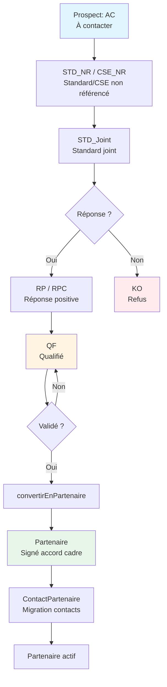
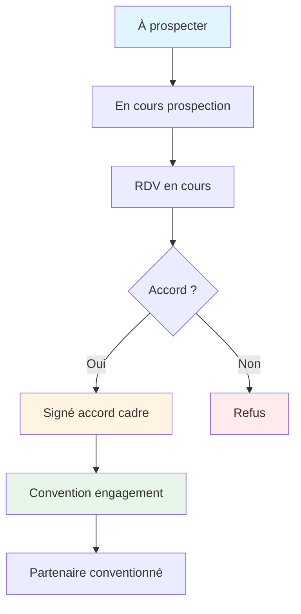
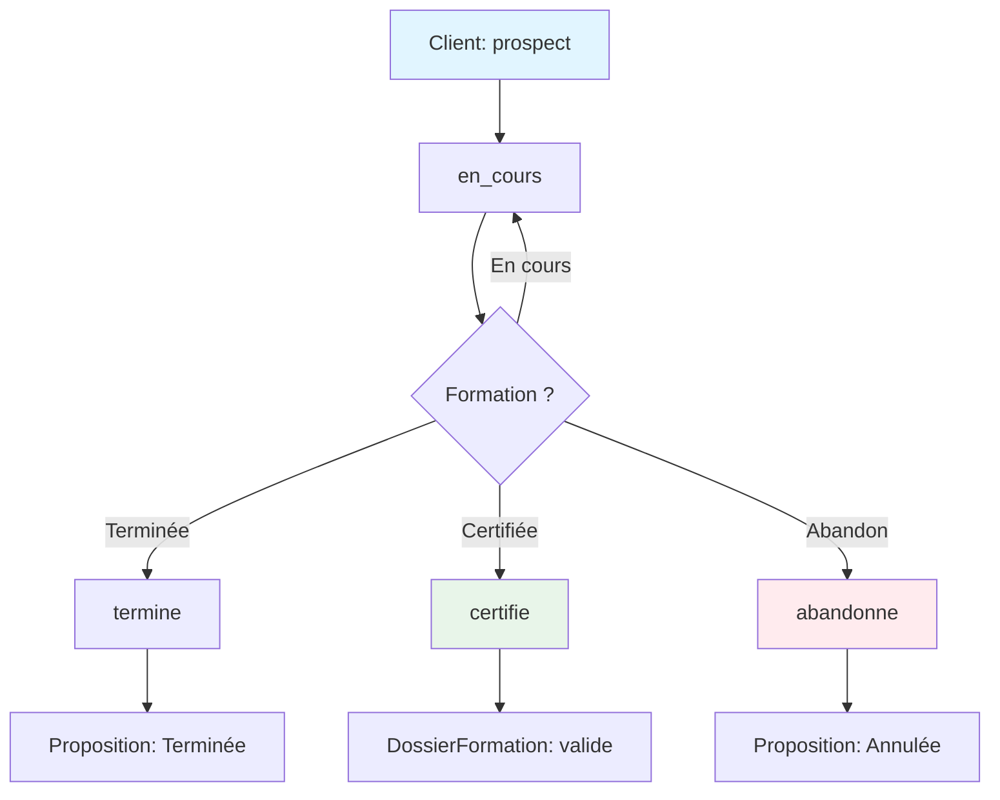
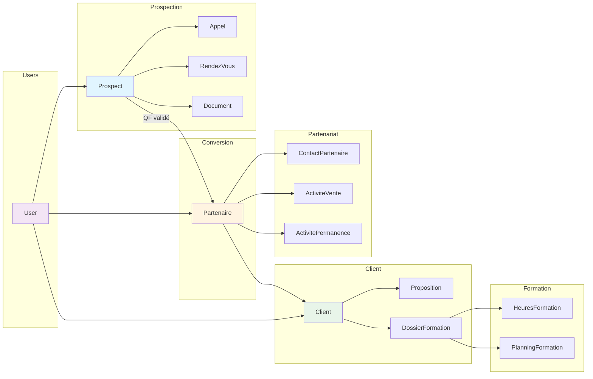
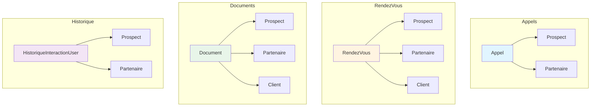
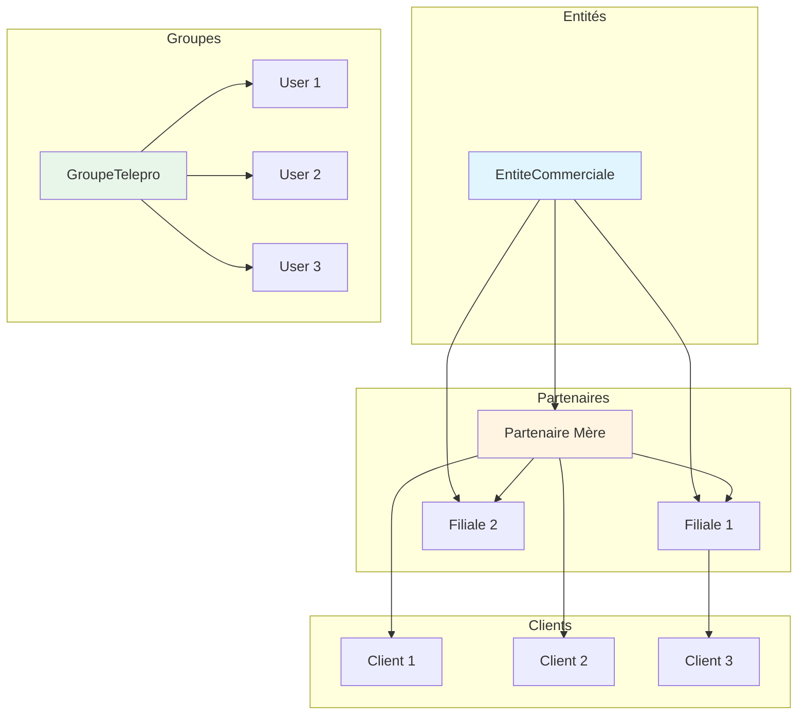
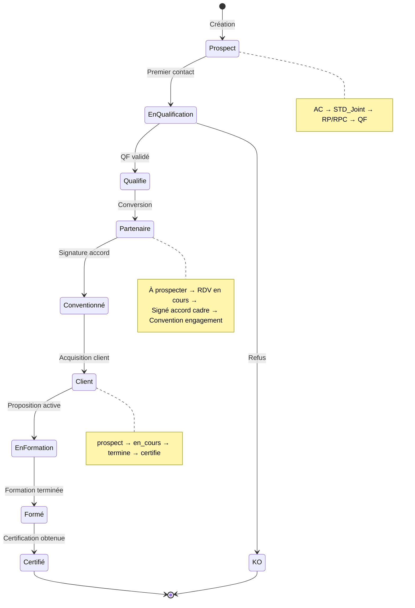
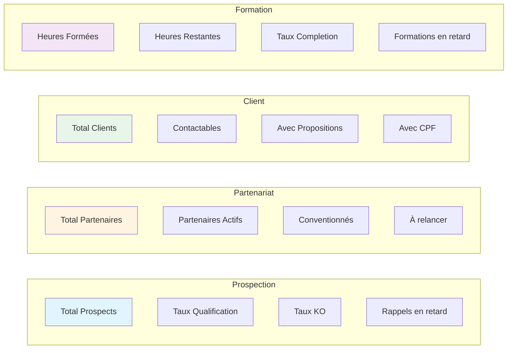

# Architecture CRM - Diagramme Mermaid

## Graph des Relations Principales

```mermaid
erDiagram
    User ||--o{ Prospect : "teleprospecteur_id"
    User ||--o{ Prospect : "commercial_id"
    User ||--o{ Prospect : "valide_par"
    User ||--o{ Partenaire : "commercial_id"
    User ||--o{ RendezVous : "commercial_id"
    User ||--o{ RendezVous : "teleprospecteur_id"
    User ||--o{ Appel : "user_id"
    User }|--|| GroupeTelepro : "belongsToMany"
    
    Prospect ||--|| CampagnePhoning : "campagne_id"
    Prospect ||--o| Partenaire : "converti_partenaire_id"
    Prospect ||--o{ Appel : "morphMany"
    Prospect ||--o{ RendezVous : "morphMany"
    Prospect ||--o{ Document : "morphMany"
    Prospect ||--o{ Opportunite : "hasOne"
    
    Partenaire ||--o{ Client : "hasMany"
    Partenaire ||--o{ ContactPartenaire : "hasMany"
    Partenaire ||--o| AdresseCse : "hasOne"
    Partenaire ||--o| Tarification : "hasOne"
    Partenaire ||--o| ActiviteVente : "hasOne"
    Partenaire ||--o| ActivitePermanence : "hasOne"
    Partenaire ||--o| RemboursementEmployeur : "hasOne"
    Partenaire ||--o{ HistoriqueConseiller : "hasMany"
    Partenaire ||--o{ AutresInterlocuteurs : "hasMany"
    Partenaire ||--o{ Appel : "morphMany"
    Partenaire ||--o{ RendezVous : "morphMany"
    Partenaire ||--o{ Document : "morphMany"
    Partenaire ||--|| EntiteCommerciale : "entite_id"
    Partenaire ||--o| Partenaire : "entreprise_mere_id"
    Partenaire ||--o| Partenaire : "parrain_partenaire_id"
    Partenaire ||--o| Consultant : "conseiller_id"
    Partenaire ||--o| Prospect : "prospect_id"
    
    Client ||--o{ Proposition : "ref_client"
    Client ||--o{ DossierFormation : "personne_id"
    Client ||--o| Partenaire : "partenaire_id"
    Client ||--o| Parrain : "parrain_id"
    Client ||--o| User : "commercial_id"
    Client ||--o{ RendezVous : "morphMany"
    Client ||--o{ Document : "morphMany"
    Client }|--|| Partenaire : "belongsToMany"
    
    Proposition }|--|| Client : "ref_client"
    
    DossierFormation ||--o| Client : "personne_id"
    DossierFormation ||--o| EntiteCommerciale : "entite_id"
    DossierFormation ||--o| Consultant : "consultant_accueil_id"
    DossierFormation ||--o| Consultant : "consultant_formateur_id"
    DossierFormation ||--o| HeuresFormation : "hasOne"
    DossierFormation ||--o| PlanningFormation : "hasOne"
    
    EntiteCommerciale ||--o{ Consultant : "hasMany"
    EntiteCommerciale ||--o{ CampagnePhoning : "hasMany"
    EntiteCommerciale ||--o{ Partenaire : "hasMany"
    EntiteCommerciale ||--o{ DossierFormation : "hasMany"
    
    CampagnePhoning ||--o| EntiteCommerciale : "entite_id"
    CampagnePhoning ||--o| GroupeTelepro : "groupe_telepro_id"
    CampagnePhoning ||--o| User : "user_id"
    CampagnePhoning ||--o{ Prospect : "hasMany"
    
    GroupeTelepro }|--|| User : "belongsToMany"
    GroupeTelepro ||--o{ CampagnePhoning : "hasMany"
    
    Consultant ||--o{ Partenaire : "conseiller_id"
    Consultant ||--o| EntiteCommerciale : "entite_id"
    Consultant ||--o| DossierFormation : "consultant_accueil_id"
    Consultant ||--o| DossierFormation : "consultant_formateur_id"
```



## Workflow Prospection → Partenariat



## Workflow Partenariat



## Workflow Client Formation



## Flux de Données Complet



## Relations Morphiques



## Structure Organisationnelle



## Cycle de Vie Complet



## KPIs et Métriques



## Intégrations Systèmes

```mermaid
graph TB
    subgraph CRM
        CRM[CRM Filament]
        U[Users]
        P[Prospects]
        PA[Partenaires]
        C[Clients]
    end
    
    subgraph Google
        G[Google API]
        GT[Google Tokens]
    end
    
    subgraph Ringover
        R[Ringover API]
        A[Appels]
    end
    
    U --> G
    U --> GT
    U --> R
    P --> A
    PA --> A
    
    CRM --> G
    CRM --> R
    
    style CRM fill:#e1f5ff
    style G fill:#fff4e1
    style R fill:#e8f5e9
```

## Permissions et Rôles

```mermaid
graph TB
    subgraph Rôles
        SA[Super Admin]
        A[Admin]
        C[Commercial]
        T[Téléprospecteur]
        O[Opérateur N1]
        BO[Back Office]
        S[Responsable Plateau]
    end
    
    subgraph Permissions
        P1[Gestion Users]
        P2[Prospection]
        P3[Gestion Partenaires]
        P4[Gestion Clients]
        P5[Support]
        P6[Supervision]
    end
    
    SA --> P1
    SA --> P2
    SA --> P3
    SA --> P4
    SA --> P5
    SA --> P6
    
    A --> P2
    A --> P3
    A --> P4
    
    C --> P2
    C --> P3
    C --> P4
    
    T --> P2
    
    O --> P5
    
    BO --> P4
    BO --> P5
    
    S --> P2
    S --> P6
    
    style SA fill:#ffebee
    style A fill:#fff4e1
    style C fill:#e8f5e9
    style T fill:#e1f5ff
